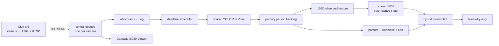

# DMC POSE

DMC POSE is the development, training, and validation source tree for the
six-bed central fall-detection system. Operators should use
`/home/dmc/AI/DMC_POSE`; developers work here.

> Current authority is `telemetry_only`. Fusion and real ALERT output are
> disabled. A loadable model or high window recall is not evidence of clinical
> readiness.

## Read first

1. [Current architecture](docs/CURRENT_ARCHITECTURE.md)
2. [Developer guide](docs/DEVELOPER_GUIDE.md)
3. [Production GRU checklist](docs/PRODUCTION_GRU_CHECKLIST_2026-08-24.md)
4. [Documentation index](docs/README.md)
5. [File audit](docs/FILE_AUDIT_2026-08-28.md)

## System flow



Resource ownership is fixed:

```text
one RTSP connection and decoder per camera
one shared weight instance per model
one temporal state per (camera_id, track_id, route)
no copied or manufactured missing temporal rows
```

## Current model choices

| Model | Current use |
|---|---|
| YOLO11m Pose | central shared pose source |
| 20Hz GRU, 80 x 109 | currently deployed telemetry shadow |
| 10Hz small GRU, 40 x 109 | deployable alternative shadow |
| legacy TCN, 30 x 109 | retained baseline |
| Swin3D-B | offline/site fine-tune and staged verifier research |
| bed segmentation + six-class posture | context evidence |

The 20Hz and 10Hz GRUs are alternative deployments. Do not run both by assuming
they share the same time contract.

## Validate the source

```bash
cd /home/dmc/AI/DMC_POSE_source
PYTHONDONTWRITEBYTECODE=1 pytest -p no:cacheprovider -q
```

Audited baseline on 2026-08-28:

```text
319 passed, 1 skipped
```

## Inspect deployment without changing it

```bash
cd /home/dmc/AI/DMC_POSE
./run.sh help
./run.sh status
./run.sh shadow-plan
./run.sh shadow-plan-10hz
```

Only `deploy-shadow*`, service start/stop/restart, and training mutate state.

## Train and fine-tune

Temporal model preparation and site video fine-tuning are separate from live
deployment. Preserve group-disjoint Train/Validation/Test splits and create a
new output directory for every run.

```bash
cd /home/dmc/AI/DMC_POSE
./site-finetune.sh check <manifest.json> [run-name]
./site-finetune.sh train <manifest.json> <run-name> [epochs]
```

See [SITE_FINETUNE_QUICKSTART.md](docs/SITE_FINETUNE_QUICKSTART.md).

## CM4 handoff

```bash
cd /home/dmc/AI/DMC_POSE_source
python scripts/build_cm4_camera_handoff.py
```

The handoff contains camera-appliance code and telemetry only. It excludes
credentials, frames, video, and heavy AI weights. Building the archive does not
install it on a Pi.

## Directory map

| Path | Purpose |
|---|---|
| `tests/` | unit and contract regression |
| `scripts/` | dataset, evaluation, training, handoff builders |
| `docs/` | current contracts plus preserved history |
| `build/` | protected runtime build artifacts; do not delete |
| `runs/` | checkpoints and reports; do not delete |
| `external_models/` | external/pretrained weights; do not delete |
| `external_datasets/` | manifests, windows, datasets; do not delete |
| `runtime_data/` | review/evidence state; do not delete |
| `config/` | model, edge, site, and temporal contracts |

## Promotion boundary

Before any real alert authority is considered, live testing must prove:

- six cameras and one RTSP session per camera;
- chosen Pose/temporal cadence with a person present;
- same-track window readiness and prediction growth;
- tracking survives rapid floor transitions;
- leakage-safe event evaluation and acceptable false alerts per valid bed-hour;
- explicit safety and authority review.

Until then every temporal output remains shadow telemetry.
