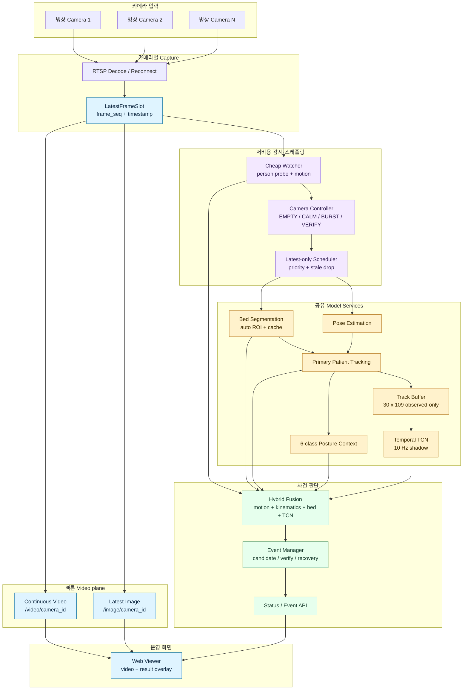
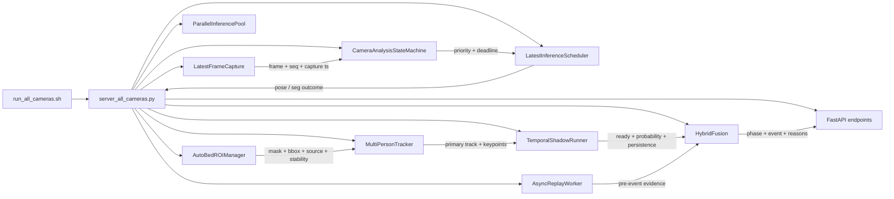
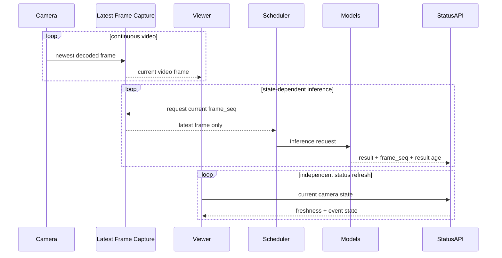
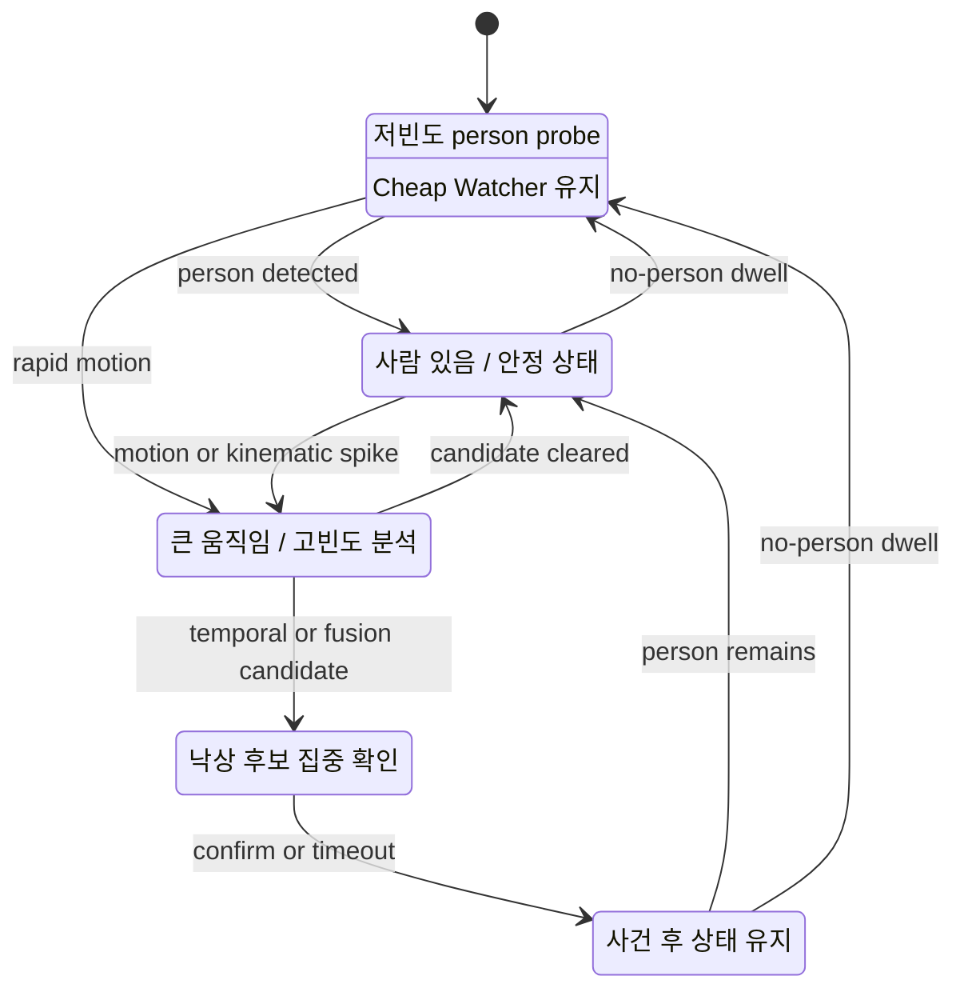
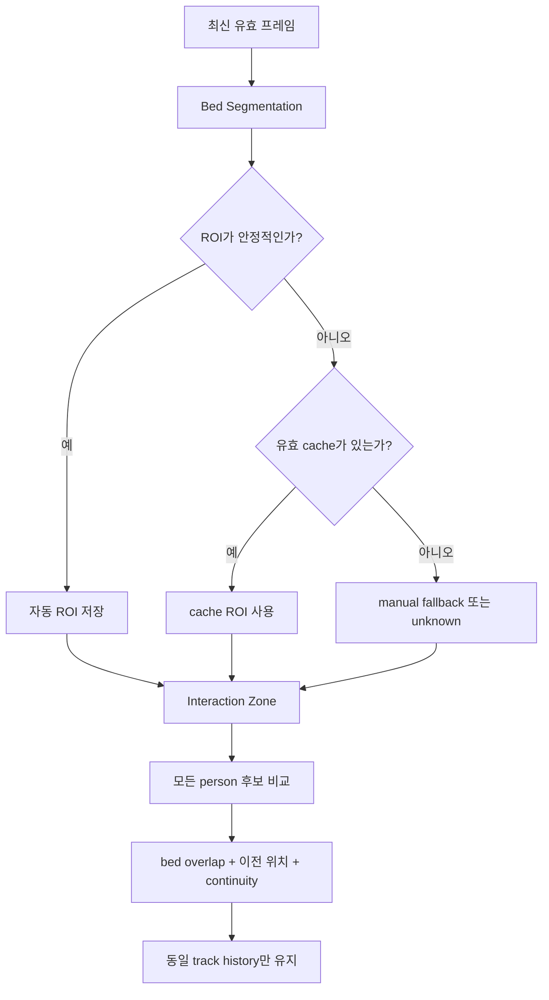
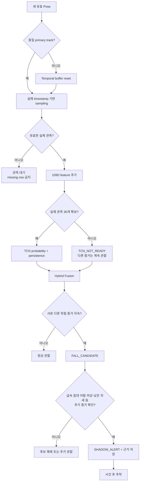
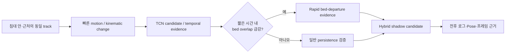
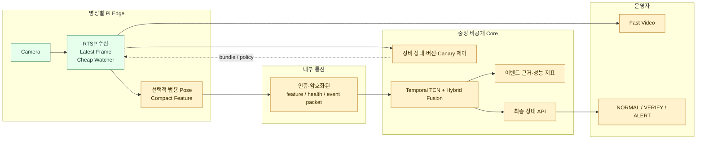
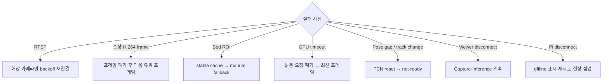

# DMC POSE — 병상 낙상 감지 AIoT 시스템

병상별 카메라 영상을 빠르게 모니터링하면서, 침대 공간 문맥과 사람 skeleton의 시간 변화를 결합해 낙상 후보를 탐지하는 다중 카메라 AIoT 프로젝트입니다.

이 문서는 개발·검증용 상세 README입니다. 로컬 운영 폴더에는 실행과 화면 확인만 설명하는 간단 README를 별도로 둡니다.

> 현재 최종 결과는 `SHADOW_ALERT` 검증 단계입니다. 의료 판단이나 실제 비상 호출을 대신하지 않으며 자동 운영 알람으로 승격되지 않았습니다.

## 1. 왜 이 구조를 사용하는가

병상마다 카메라가 한 대씩 늘어날 때 중앙 서버가 모든 영상의 모든 프레임을 같은 강도로 분석하면 GPU·CPU·네트워크가 쉽게 병목에 도달합니다. 반대로 AI 결과를 기다리느라 화면이 늦어지면 실시간 모니터링의 의미가 사라집니다.

따라서 이 프로젝트는 다음 두 경로를 분리합니다.

- **Video plane:** 운영자가 보는 영상은 최신 프레임 중심으로 빠르게 전달합니다.
- **Inference plane:** 사람이 있거나 위험한 움직임이 생길 때만 계산 자원을 집중합니다.

자세 이름을 매 프레임 브리핑하는 것이 목적이 아닙니다. 자세·관절·속도·침대 관계는 내부 근거로 사용하고, 최종적으로는 낙상 사건 상태를 전달합니다.

## 2. 현재 검증된 중앙 서버 구조



### 현재 런타임의 핵심

- 중앙 Python 런타임이 6개 카메라 thread를 관리합니다.
- RTSP decoder는 오래된 프레임이 쌓이지 않도록 계속 drain합니다.
- 모델 요청은 FIFO 영상 큐가 아니라 카메라별 최신 프레임을 사용합니다.
- Bed segmentation과 Pose 모델은 공유 instance로 실행합니다.
- TCN history는 카메라 전체가 아니라 primary person track별로 관리합니다.
- Viewer 영상과 AI 상태 갱신은 서로 독립적입니다.

### 실제 구현 파일 매핑

아래 표는 개념 이름이 아니라 현재 source tree에서 실제로 연결되는 모듈과 책임입니다.

| 실행 단계 | 실제 구현 | 런타임 책임 |
|---|---|---|
| 시작 스크립트 | `run_all_cameras.sh` | 환경변수와 모델 파일을 확인하고 중앙 FastAPI 런타임을 시작 |
| 중앙 Orchestrator | `server_all_cameras.py` | 카메라 구성, 모델 1회 로드, camera loop, 공유 상태, Viewer/API 수명주기 관리 |
| 최신 프레임 수신 | `latest_frame_capture.py` / `LatestFrameCapture` | RTSP를 계속 읽고 `frame_seq`와 timestamp가 붙은 최신 프레임만 제공 |
| 사전 이벤트 ring buffer | `frame_buffer.py` / `FrameBuffer` | 후보 사건 직전 프레임을 제한된 메모리에 유지 |
| 저비용 움직임 | `motion_watcher.py` / `MotionWatcher` | downscale frame 기반 motion과 rapid-motion wake signal 생성 |
| 카메라 상태 | `analysis_state_machine.py` / `CameraAnalysisStateMachine` | `EMPTY`, `OCCUPIED_CALM`, `BURST`, `VERIFY`, `RECOVERY` 전이와 실행 주기 결정 |
| 중앙 GPU 조정 | `inference_scheduler.py` / `LatestInferenceScheduler` | `(model, camera)`별 mailbox 하나, 새 요청 supersede, deadline/stale drop, priority·fairness 관리 |
| 침대 ROI | `auto_bed_roi.py` / `AutoBedROIManager` | segmentation 결과 안정화, scene fingerprint, cache/fallback 관리 |
| 공간 기하 | `spatial_geometry.py` | ROI 방향 보정, bed 후보 선택, skeleton-bed coverage 계산 |
| Pose 후보 필터 | `pose_candidate_filter.py` | 약한/깨진 person 후보 제거 및 tracking bbox 선택 |
| 다중 사람 추적 | `person_tracker.py` / `MultiPersonTracker` | 사람별 track 유지와 primary patient 연속성 제공 |
| 현재 자세 보조 | `bed_monitor/*` 및 Keras predictor | 현재 keypoint 자세를 보조 문맥으로 변환 |
| 109D feature | `temporal_features.py` | 17 keypoint와 파생값을 학습/라이브 공통 feature vector로 변환 |
| TCN 모델 | `temporal_model.py` / `FallTCN` | causal temporal convolution network 정의 |
| Live TCN | `live_temporal.py` / `TemporalModelService`, `TemporalShadowRunner` | checkpoint·정규화 로드, track window와 persistence 관리 |
| Hybrid 사건 판단 | `hybrid_fusion.py` / `HybridFusion` | motion, kinematics, posture, bed relation, TCN을 결합해 phase/result 생성 |
| 비동기 replay | `async_replay_worker.py`, `pre_event_replay.py` | 실시간 camera loop를 막지 않고 후보 직전 구간을 재추론 |
| 학습 근거 기록 | `shadow_feature_recorder.py`, `temporal_session_recorder.py` | shadow feature와 명시적 사건 session 기록 |
| Edge 전송 신뢰성 | `edge_outbox_v1.py` / `EdgeOutboxSender` | compact message의 pending/ack/retry 관리 |
| Edge 제어 API | `run_edge_control_server_secure_v2.py` | 인증된 edge health·bundle/canary 제어 서버 진입점 |
| 입력 계약 | `config/temporal_contract_v2.json` | target Hz, window, feature schema와 missing/track 규칙 고정 |
| Edge bundle 계약 | `config/edge_model_bundle_v1.json` | 배포 artifact, hash, 장비 호환 정보의 기준 |
| 근거 시각화 | `scripts/build_fall_event_evidence.py` | 사건 JSONL을 그래프·요약 JSON·보고서 근거로 고정 |

### 중앙 프로세스 내부 호출 관계



### 실제 HTTP 경계

| Endpoint | 소비자 | 의미 |
|---|---|---|
| `/viewer` | 로컬 운영 브라우저 | 다중 카메라 video plane과 상태 overlay |
| `/video/{camera_id}` | Viewer | continuous MJPEG fallback stream |
| `/image/{camera_id}` | 진단/초기 화면 | 해당 카메라의 최신 JPEG snapshot |
| `/status` | 기존 Viewer | 기존 호환 전체 상태 snapshot |
| `/api/v2/status` | 신규 client | versioned fleet 상태 |
| `/api/v2/status/{camera_id}` | 신규 client | 특정 카메라 상태와 freshness |
| `/health/live` | process supervisor | 프로세스 생존 여부 |
| `/health/ready` | 배포·운영 도구 | 모델과 필수 runtime 준비 여부 |
| `/health/cameras` | 운영 진단 | 카메라 fleet 연결 상태 |
| `/metrics` | monitoring | scheduler·capture·event 지표 |
| `/recorder/status` | 데이터 수집 도구 | shadow recorder 상태 |
| `/temporal-recorder/status` | temporal 수집 도구 | 사건 session recorder 상태 |

`/video` 요청이 200이어도 AI 결과가 최신이라는 의미는 아닙니다. client는 상태의 capture/result freshness와 TCN ready를 별도로 확인해야 합니다.

## 3. 영상과 AI 결과의 분리



이 분리로 얻는 효과:

- Viewer FPS와 AI inference FPS를 다르게 설정할 수 있습니다.
- AI가 느려져도 오래된 영상이 순서대로 재생되지 않습니다.
- 한 카메라 오류가 다른 카메라 전체를 막지 않습니다.
- 결과 지연은 화면 정지가 아니라 `result age`로 관측할 수 있습니다.

## 4. 부하 절감 상태머신



Cheap Watcher는 낙상을 판정하지 않고 비싼 모델을 깨우는 역할만 합니다. 부하가 높아도 RTSP drain, Viewer 영상, Cheap Watcher, `VERIFY` 필수 관측은 우선 유지합니다.

## 5. 침대 자동 인식과 환자 track



한 화면에 환자·의료진·보호자가 함께 있을 수 있으므로 첫 번째 검출 사람을 환자로 가정하지 않습니다. primary track이 바뀌거나 Pose gap이 커지면 이전 skeleton history는 reset합니다.

## 6. 낙상 판단 플로우



### 신호별 역할

| 신호 | 역할 | 현재 단독 알람 |
|---|---|---:|
| 사람/track | 동일 대상의 시간축 보장 | 아니오 |
| 침대 overlap·zone | 침대 안·가장자리·밖 문맥 | 아니오 |
| 6-class posture | 누움·앉음 등 현재 자세 보조 | 아니오 |
| skeleton kinematics | 하강·회전·속도 변화 | 아니오 |
| Cheap Watcher motion | 분석 wake-up | 아니오 |
| TCN persistence | 연속 Pose 변화의 낙상 가능성 | 아니오 |
| Hybrid Fusion | 상호 독립적인 증거 결합 | shadow 사건만 |

### 시계열 입력 계약

- 실제 시간 기준 10 Hz
- window마다 실제 Pose 관측 30개
- feature dimension 109
- synthetic missing row 금지
- 이전 skeleton 복사 금지
- track 변경 또는 큰 gap에서 reset
- 학습 extractor와 live runtime 입력 의미 일치

이 규칙은 빈 행을 채워 넣어 TCN이 준비된 것처럼 보이는 오류를 방지합니다.

## 7. 빠른 침대 이탈 Hybrid 경로



세부 threshold는 버전이 있는 제한 설정과 코드로 관리하며 일반 운영 화면에는 노출하지 않는 것이 원칙입니다.

## 8. 목표 Pi-first 구조

아래는 **목표 구조**입니다. 모든 Pi에 배포가 끝난 상태가 아니며 한 대 canary 검증 후 확장해야 합니다.



| 위치 | 책임 | 배치 이유 |
|---|---|---|
| Pi | 카메라 연결, decoder drain, 최신 프레임, watcher, health | 병상 증가 시 중앙 I/O 부담 감소 |
| Pi 선택 기능 | 범용 Pose·compact feature | 원본 영상 전송량과 중앙 GPU 요청 감소 |
| 중앙 | 모델 버전, TCN, Fusion, 최종 사건 | 일관된 업데이트·감사·핵심 로직 보호 |
| Viewer | 영상과 최소 사건 상태 | 내부 feature를 몰라도 운영 가능 |

RTSP는 영상 전달에 사용하고, feature·모델 상태·최종 결과는 인증된 별도 API 또는 지속 연결 프로토콜로 분리합니다. TCP/IP는 이들 통신의 기반 계층이지 모델 배포 포맷 자체가 아닙니다.

## 9. 활용 방식

### 병상 안전 모니터링

- 여러 병상 영상을 한 Viewer에서 관찰
- 빈 병상에서 분석 부하 자동 감소
- 급격한 침대 이탈과 낙상 의심 구간 집중 분석
- 후보 사건 전후 근거 replay

### 병원·요양원 PoC

- 설치 각도와 조명 차이에 맞춘 자동 ROI/cache
- 정상 침대 이탈, 의료진 부축, 물건 줍기 등 hard-negative 수집
- 실제 알람을 켜기 전 shadow mode 성능 측정

### 데이터·모델 개선

- 자동 캡처 이벤트를 사람이 검토해 positive/negative 데이터화
- 동일 replay set으로 TCN·Fusion 변경 전후 비교
- 공개 데이터와 자체 병실 영상을 같은 observed-only 계약으로 재추출

### Edge 제품화

- 병상별 Pi를 독립 camera appliance로 운영
- 장비 유형별 bundle을 canary → 일부 → 전체 순서로 배포
- 중앙에는 가벼운 compact feature와 health를 전달해 확장성 확보

### 다른 공간 문제로 확장

- 제한 구역 이탈
- 휠체어·의자의 위험한 일어서기
- 장시간 움직임 없음 후보
- 작업자 위험 구역 접근
- 설비 주변의 급격한 자세 변화

각 용도는 별도 데이터와 사건 정의, threshold 및 안전 검증이 필요합니다.

## 10. 현재 상태와 남은 조건

| 영역 | 현재 상태 | 다음 승격 조건 |
|---|---|---|
| 중앙 6카메라 Viewer | 동작 확인 | 장시간 freshness·decode 지표 |
| 자동 Bed ROI | 적용 | 이동·가림·cache 복구 검증 |
| 최신 프레임 Scheduler | 적용 | 부하별 latency·fairness 측정 |
| observed-only TCN | shadow | temporal label 확대 및 외부평가 |
| Hybrid Fusion | 통제 낙상 시험 검출 | 다양한 낙상과 hard-negative 반복 |
| 이벤트 근거 저장 | 구현 | 개인정보·보존 정책 확정 |
| Pi canary | 부분 준비 | 서비스·bundle·rollback 장비 검증 |
| 실제 운영 알람 | 미승격 | recall·오탐/bed-hour·latency 기준 충족 |

통제 시험 한 건의 검출은 경로가 작동한다는 근거이지 실제 환경 전체 성능을 보장하지 않습니다.

## 11. 운영·성능 지표

| 계층 | 주요 지표 |
|---|---|
| Camera | uptime, last-frame age, decode/reconnect count |
| Viewer | delivered FPS, 영상 freshness |
| Scheduler | wait time, stale drop, camera fairness |
| Pose/TCN | observation coverage, ready coverage, reset count |
| Event | precision, recall, false alerts/valid bed-hour, latency |
| Edge | heartbeat age, CPU/RAM/temperature, bundle version |

사건 평가는 `context-eligible conditional recall`과 전체 `end-to-end recall`을 분리해야 합니다. TCN이 준비되지 않은 사건을 모델 오분류와 같은 원인으로 처리하면 병목을 잘못 판단하게 됩니다.

## 12. 장애 복구



## 13. 실행

```bash
cd /home/dmc/AI/DMC_POSE
./run_all_cameras.sh
```

```text
Viewer: http://<server-ip>:8000/viewer
Status: http://<server-ip>:8000/status
```

## 14. 저장소·보안 경계

다음 항목은 소스 저장소에 커밋하지 않습니다.

- RTSP 계정·비밀번호와 실제 camera config
- 실제 병실 영상·환자 데이터
- 학습 데이터 원본
- 모델 weight와 운영 비밀 설정
- runtime log·status dump·event 원본 이미지
- SSH private key·API token

일반 Viewer에는 영상, 연결 상태, 최종 사건 상태만 노출하는 것이 적합합니다. 모델 probability, 109D feature, Fusion evidence, 정책 버전은 인증된 관리자 경로에서만 다룹니다.

Git 저장소가 private이어도 로컬 평문 소스에 읽기 권한이 있는 사용자는 구조를 분석할 수 있습니다. 기밀 Core를 실제로 보호하려면 별도 권한 경계, 암호화된 artifact, 중앙 API, secret 관리와 감사 로그가 필요하며 난독화만으로는 충분하지 않습니다.

## 15. 관련 문서

- [`docs/BLACKBOX_RUNTIME_GUIDE.md`](docs/BLACKBOX_RUNTIME_GUIDE.md)
- [`docs/FALL_DETECTION_OPERATIONAL_READINESS_2026-08-14.md`](docs/FALL_DETECTION_OPERATIONAL_READINESS_2026-08-14.md)
- [`docs/FALL_EVENT_LOG_POSE_EVIDENCE_2026-08-14.md`](docs/FALL_EVENT_LOG_POSE_EVIDENCE_2026-08-14.md)
- [`docs/architecture_v2/01_RUNTIME_ARCHITECTURE.md`](docs/architecture_v2/01_RUNTIME_ARCHITECTURE.md)
- [`docs/architecture_v2/03_INFERENCE_AND_FUSION.md`](docs/architecture_v2/03_INFERENCE_AND_FUSION.md)
- [`docs/PI_CANARY_RUNBOOK_V2.md`](docs/PI_CANARY_RUNBOOK_V2.md)
- [암호화 snapshot 복원](ENCRYPTED_SNAPSHOT.md)
