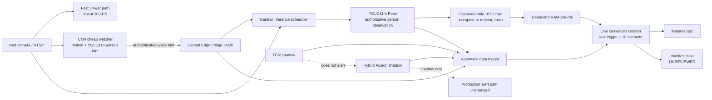

# Automatic Temporal Event Capture Contract

Date: 2026-08-10  
Scope: `bed_161` canary, central server `.108`, Edge CM4 `.161`

## Outcome

The runtime now captures trainable-format temporal evidence automatically.
Nobody presses a start or stop button. The capture path is independent from
the production alert path, and every new session starts as `UNREVIEWED`.

## End-to-end flow



The viewer never waits for Pose, TCN, Fusion, or disk writes. The writer is a
separate daemon thread and receives only 109D vectors and small metadata.

## What “automatic start” means

The first rising transition below opens a session:

- `EDGE_WAKE_RISE`: the CM4 reports a new wake episode.
- `PERSON_ENTER`: the central YOLO11m Pose path first observes the primary person.
- `TCN_CANDIDATE_RISE`: TCN shadow changes from non-candidate to candidate.
- `FUSION_CANDIDATE_RISE`: Fusion enters `CANDIDATE`, `VERIFY`, or `SHADOW_ALERT`.
- `PRIMARY_TRACK_CHANGE`: the authoritative primary track changes person ID.
- `PERSON_EXIT`: the retained primary track expires after the configured TTL;
  a single missed Pose frame does not count as an exit.

The trigger does not declare that a fall occurred. It only says “retain this
time neighborhood for review.” Repeated triggers during the same episode are
merged into one session and recorded in the manifest.

## What “automatic end” means

- Normal close: 10 seconds after the most recent trigger.
- Trigger extension: another trigger resets the 10-second post-roll deadline.
- Safety close: 180 seconds after the first trigger.
- Shutdown close: graceful central server shutdown flushes an active session.
- Model-only re-arm: after a session closes, a TCN-only rising edge cannot
  reopen another session for 60 seconds. Edge, person, track, and Fusion
  triggers are never suppressed by this protection.

The saved interval contains up to 10 seconds of valid observed Pose rows from
before the first trigger, plus observed rows through the post-roll. It is not a
fixed video clip. Empty time and missing Pose are not manufactured as rows.

## Saved artifact

```text
runtime_data/temporal_sessions/
└── bed_161_<UTC session id>/
    ├── features.npz
    │   ├── features                  float32 [N, 109]
    │   ├── relative_timestamps_sec   float64 [N]
    │   ├── track_ids                 int64   [N]
    │   └── pose_quality              float32 [N]
    └── manifest.json
```

The manifest contains trigger names, duration, track IDs, schema version, and
review state. It explicitly records:

```text
label = UNREVIEWED
training_eligible = false
contains_video = false
contains_images = false
contains_raw_keypoints = false
```

Each new session also records `trigger_contexts`. Context is counted backward
from every trigger only while observations remain on the same primary track
and cadence stays within 70–250 ms. `tcn_context_ready` requires 30 contiguous
observed rows. `long_pre_context_ready` requires at least 8 seconds and 80
observed rows. These fields measure data usability; they do not declare a fall.

For a physical long-context smoke test:

```bash
python3 scripts/validate_temporal_event_session.py \\
  --require-long-context \\
  --timeout-sec 240 \\
  --report runtime_data/reports/temporal_long_context_smoke.json
```

An edge-control API connection is not considered healthy when its latest node
result is stale. After the configured grace period the central motion watcher
and normal empty-room probe cadence resume automatically.

## Physical long-context validation — 2026-08-14

The `bed_161` automatic smoke test passed without manual frame entry:

- one retained primary track;
- 221 observed-only 109-D rows over 28.65 seconds;
- best pre-trigger context: 118 contiguous rows over 15.10 seconds;
- both `tcn_context_ready` and `long_pre_context_ready` true;
- no images, video, or raw keypoints persisted;
- no recorder error or queue drop.

The result is stored at
`runtime_data/reports/temporal_long_context_smoke.json`. Local central motion
now emits `LOCAL_MOTION_RISE`, so a fast movement is retained for later review
even when the edge result or temporal classifier does not produce a candidate.

No TCN or Fusion prediction is automatically converted into ground truth.

## Resource and privacy boundaries

- RTSP viewing remains continuous and fast.
- CM4 work remains a low-cost scheduling hint.
- Central YOLO11m remains the authoritative Pose observation.
- Disk compression cannot block the live inference thread.
- A trigger with zero valid Pose rows writes no empty NPZ.
- Old pre-roll is expired even while the room stays empty.
- The current canary records only `bed_161`.
- No video, image, RTSP credential, or raw 17-keypoint coordinate array is saved.
- The derived 109D vector is still sensitive behavioral data and remains local.

## Runtime observability

```text
GET http://127.0.0.1:8000/temporal-recorder/status
GET http://127.0.0.1:8000/health/ready
```

Important fields:

```text
active_cameras
ring_samples
trigger_counts
completed_total
written_total
skipped_empty_total
dropped_total
invalid_total
error_total
last_session_dir
```

The automatic end-to-end validator is:

```bash
python3 scripts/validate_temporal_event_session.py \
  --timeout-sec 180 \
  --report runs/edge_benchmarks/cm4_bed_161/temporal_session_validation.json
```

## Current verification

- Full repository test suite after review, curation, debounce, and re-arm work:
  209 passed.
- Central readiness: all checks true, including the temporal writer.
- Empty-bed 30-second check: zero false sessions, zero errors, zero drops.
- First physical validation wait: no subject entered during the 180-second
  window, so no session was expected or written. This is an input-absent result,
  not a recorder failure.
- Physical normal entry/presence/exit: passed; 183 observed rows over 24.01
  seconds, one track, zero writer errors or drops. Single-frame Pose misses
  initially produced enter/exit chatter; presence triggering now follows the
  retained track TTL.
- Physical normal lying: passed; 181 observed rows over 23.35 seconds, one
  track, `PERSON_ENTER` exactly once, and zero writer errors or drops. TCN
  candidate rose twice on this non-fall action while Fusion did not promote an
  alert, making the session a valuable hard negative.
- Reviewed controlled-protocol sessions now produce 124 cadence-safe
  `30x109` negative windows. Training remains blocked because positive class
  coverage and leakage-safe group split assignment are still missing.
- Repeated TCN-only session openings are now protected by a 60-second model
  re-arm interval; Edge/person/track/Fusion triggers are never suppressed.
- TCN remains shadow-only and is not promoted by this work.
