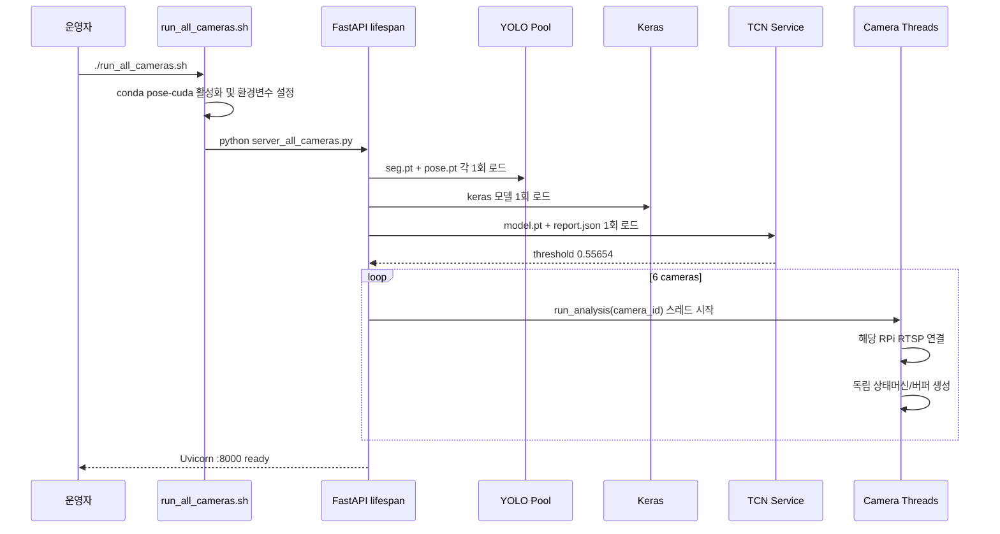
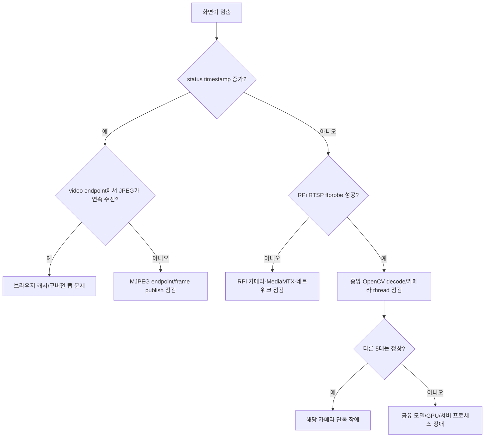

# DMC_POSE 런타임 블랙박스 해설 아티팩트

> 기준 경로: `/home/dmc/AI/DMC_POSE`  
> 기준 런타임: 중앙 서버 `192.168.0.108:8000`, RPi RTSP 카메라 6대  
> 목적: 코드 내부를 몰라도 “누가 영상을 보내고, 누가 가중치를 들고, 누가 추론하고, 어디서 결과를 보는가”를 설명한다.

## 0. 먼저 한 문장으로

**RPi는 영상을 RTSP로 내보내기만 하고, 중앙 서버의 단일 Python 프로세스가 네 개의 모델 가중치를 메모리에 올린 다음 여섯 카메라를 분석하여 `/status`와 `/viewer`로 결과를 제공한다.**

여기서 “가중치 서빙”은 현재 Triton/TorchServe 같은 별도 모델 서버가 아니다. `server_all_cameras.py` 프로세스 내부에서 모델을 직접 호출하는 **인프로세스 서빙**이다.

## 1. 물리 장치와 책임 경계

| 위치 | 하는 일 | 하지 않는 일 |
|---|---|---|
| RPi 161/162/174/175/178/179 | 카메라 촬영, H.264 인코딩, `/stream` RTSP 송출 | YOLO·Keras·TCN 추론, 최종 판정, API 제공 |
| 중앙 서버 192.168.0.108 | RTSP 수신, 모든 모델 로딩 및 추론, 상태 병합, 웹/API 제공 | 카메라 센서 직접 제어 |
| 모니터링 PC 192.168.0.114 등 | 브라우저로 영상과 상태를 조회 | 모델 실행, RTSP 원본 분석 |

중요한 방향은 다음과 같다.

```text
영상:       RPi ──RTSP/H.264──> 중앙 서버
결과:       중앙 서버 ──HTTP/JSON──> 모니터링 클라이언트
모니터 영상: 중앙 서버 ──HTTP/MJPEG──> 브라우저
```

현재 RPi가 중앙 서버로부터 추론값을 직접 “돌려받는” 연결은 없다. RPi나 별도 앱이 결과를 사용하려면 중앙 서버의 `/status`를 호출하는 클라이언트가 추가로 필요하다.

## 2. 전체 런타임 구조

```mermaid
flowchart LR
    subgraph EDGE[RPi × 6]
        CAMERA[카메라]
        H264[H.264 인코더]
        RTSP[MediaMTX/RTSP :8554/stream]
        CAMERA --> H264 --> RTSP
    end

    subgraph CENTRAL[중앙 서버 192.168.0.108]
        SHELL[run_all_cameras.sh]
        PROC[Python server_all_cameras.py]
        FASTAPI[FastAPI :8000]
        THREADS[카메라 분석 스레드 × 6]
        POOL[공유 YOLO 추론 풀]
        KERAS[공유 Keras 6-class]
        TCN[공유 TCN 모델 서비스]
        PER_CAM[카메라별 상태·3초 TCN 버퍼]

        SHELL --> PROC
        PROC --> FASTAPI
        PROC --> THREADS
        PROC --> POOL
        PROC --> KERAS
        PROC --> TCN
        THREADS --> PER_CAM
        POOL --> PER_CAM
        KERAS --> PER_CAM
        TCN --> PER_CAM
        PER_CAM --> FASTAPI
    end

    subgraph CLIENT[브라우저/클라이언트]
        VIEWER[/viewer]
        VIDEO[/video/bed_ID]
        STATUS[/status]
    end

    RTSP -->|중앙 서버가 pull| THREADS
    FASTAPI --> VIEWER
    FASTAPI --> VIDEO
    FASTAPI --> STATUS
```

## 3. 실제 OS 프로세스 관점

```text
/bin/bash ./run_all_cameras.sh
└── python server_all_cameras.py
    ├── FastAPI/Uvicorn HTTP 서버 :8000
    ├── 공유 YOLO 모델 2개
    ├── 공유 Keras 모델 1개
    ├── 공유 TCN 모델 1개
    └── run_analysis 카메라 스레드 6개
        ├── bed_161 RTSP 연결 + 독립 상태/버퍼
        ├── bed_162 RTSP 연결 + 독립 상태/버퍼
        ├── bed_174 RTSP 연결 + 독립 상태/버퍼
        ├── bed_175 RTSP 연결 + 독립 상태/버퍼
        ├── bed_178 RTSP 연결 + 독립 상태/버퍼
        └── bed_179 RTSP 연결 + 독립 상태/버퍼
```

카메라마다 Python 프로세스를 하나씩 띄우는 구조가 아니다. **프로세스 1개 안에 카메라 스레드 6개**가 있다. 모델 가중치 역시 카메라마다 복사해서 로드하지 않고 공유한다. 단, 시계열 버퍼와 상태는 카메라마다 분리된다.

## 4. 가중치 서빙의 실체

### 4.1 현재 로드되는 모델

| 역할 | 파일 | 프레임워크 | 기본 장치 | 로드 횟수 | 크기 |
|---|---|---|---|---:|---:|
| 침대 segmentation | `yolo11n-bed-seg.pt` | Ultralytics/PyTorch | GPU 0 | 1회 | 5,976,036 B |
| 사람 pose 17 keypoint | `yolo11m-pose.pt` | Ultralytics/PyTorch | GPU 0 | 1회 | 42,459,307 B |
| 병상 자세 6-class | `my_model_six_check.keras` | Keras/TensorFlow | CPU 의도 | 1회 | 539,259 B |
| 3초 낙상 시계열 | `runs/temporal_tcn/gmdcsa24_tcn/model.pt` | PyTorch | CPU 기본 | 1회 | 243,505 B |
| TCN threshold/평가정보 | `runs/temporal_tcn/gmdcsa24_tcn/report.json` | JSON | 해당 없음 | 1회 | 2,133 B |

“공유”의 뜻은 여섯 카메라가 같은 모델 객체를 사용한다는 의미다. `TemporalModelService`는 TCN 모델을 한 번 메모리에 올리고 내부 lock으로 동시에 모델을 건드리지 않게 한다. 카메라별 `TemporalShadowRunner`는 모델을 가지지 않고 자신의 30행 버퍼만 가진다.

### 4.2 파일 식별 SHA-256

```text
7c37010c923ad576502365f41a719f7bd45c91fef46dd3a12947a47ee8f99a40  yolo11n-bed-seg.pt
29b17eaf3a3117cbea906090dbedf9159f7c6a49db58ec8b99ed2dfde1cf6eb2  yolo11m-pose.pt
82f4314c0bef77340747cd1b3b2c0941e0f43b0ef7fbf9120d48b6f55fb3f673  my_model_six_check.keras
f93f257705acce418900cc85d0e39b4df55a48f47ba3e26377c29537338a71e4  runs/temporal_tcn/gmdcsa24_tcn/model.pt
f0a7bd8ca47e6f4e51aedf8fb025fd6323200541d0c2d2f770d5170c06e2b60e  runs/temporal_tcn/gmdcsa24_tcn/report.json
```

해시가 달라지면 같은 이름이어도 다른 가중치다. 운영 배포 시 파일명뿐 아니라 해시를 함께 기록해야 한다.

### 4.3 현재 구조와 “진짜 별도 모델 서버” 비교

| 구분 | 현재 구조 | 별도 모델 서버 구조 |
|---|---|---|
| 모델 위치 | FastAPI 카메라 서버 프로세스 내부 | Triton/TorchServe/별도 inference API |
| 호출 방식 | Python 함수 호출 | HTTP/gRPC 요청 |
| 장점 | 단순하고 지연이 작음 | 독립 확장·버전 교체·모델별 자원 분리가 쉬움 |
| 단점 | 카메라/API/모델 장애 경계가 묶임 | 운영 구성과 네트워크가 복잡해짐 |
| 현재 단계 적합성 | shadow 검증 단계에 적합 | 카메라 수·트래픽이 커지면 검토 |

## 5. 서버가 켜질 때 정확히 일어나는 순서



TCN 로드가 실패하면 예외를 기록하고 `temporal_service=None`으로 기존 rule/Keras 서버는 계속 실행된다. YOLO나 Keras 초기 로드 실패는 현재 전체 startup을 실패시킨다.

## 6. 카메라 한 프레임의 여행

```mermaid
flowchart TD
    A[RPi RTSP H.264 frame] --> B[OpenCV/FFmpeg decode]
    B --> C[width 640 resize]
    C --> D[YOLO bed segmentation]
    C --> E[Motion detector]
    D --> F[Bed ROI/zone]
    E --> G{상태머신이 pose 실행?}
    G -->|아니오| H[IDLE 상태 갱신]
    G -->|예| I[YOLO pose 17 keypoints]
    I --> J[기존 rule feature/scorer]
    I --> K[Keras 6-class]
    I --> L[TCN 109-feature row]
    K --> L
    L --> M[카메라별 10 Hz / 30행 버퍼]
    M --> N{30행 준비?}
    N -->|예, 0.5초 stride| O[공유 causal TCN]
    O --> P[fall probability]
    J --> Q[CameraState]
    K --> Q
    P --> Q
    Q --> R[/status JSON]
    C --> S[/video MJPEG]
```

### 상태머신 속도

| 상태 | 의미 | 목표 처리율 |
|---|---|---:|
| `idle` | 사람 없음, 저비용 감시 | 3 FPS |
| `detecting` | 사람 후보, 버퍼 수집 | 10 FPS |
| `analyzing` | 자세 상세 분석 | 20 FPS |
| `tracking` | 사람 지속 추적 | 15 FPS |

`pipeline_fps≈3.1`이고 `analysis_state=idle`이면 고장이 아니라 설계된 저속 모드다.

## 7. TCN을 박스 안에서 꺼내 보기

```text
한 카메라의 pose 1회
  └─ normalized XY                34
  └─ keypoint confidence         17
  └─ keypoint visibility         17
  └─ Keras 6-class probability    6
  └─ person flag                  1
  └─ normalized XY velocity      34
                                ───
                                109 features

10 Hz로 30개 수집 = (30 time steps × 109 features) = 약 3초
                        ↓
                  causal TCN 1회
                        ↓
             tcn_fall_probability 0~1
                        ↓
              threshold 0.55654 비교
                        ↓
              2회 연속이면 candidate
```

현재 `candidate`는 **shadow 결과**다. 기존 `fall_score`, `fall_status`, 실제 알림을 바꾸지 않는다.

사람이 없을 때 `tcn_samples=0`, `tcn_shadow_ready=false`, `probability=0`은 정상이다. 유효 pose가 계속 들어와야 30개가 채워진다. 0.5초 넘게 pose가 끊기면 과거와 현재를 잘못 연결하지 않도록 버퍼를 초기화한다.

## 8. HTTP 엔드포인트를 누가 왜 호출하는가

| 주소 | 호출자 | 응답 | 연결 성격 |
|---|---|---|---|
| `/viewer` | 브라우저 | 대시보드 HTML | 페이지 로드 시 |
| `/video/bed_161` 등 | 브라우저 `` | multipart MJPEG | 지속 연결 |
| `/status` | viewer JavaScript/외부 앱 | 6대 상태 JSON | 0.5초 폴링 |
| `/image/bed_161` 등 | 진단/구버전 viewer | JPEG 1장 | 단발 요청 |

새 viewer는 `/video/...`를 사용한다. 로그에 `/image/bed_*?t=...`가 반복되면 그 브라우저 탭은 구버전 HTML을 아직 들고 있는 것이다. `Ctrl+Shift+R`로 새로고침하거나 탭을 닫아야 한다.

## 9. `/status`를 읽는 법

| 필드 | 질문 | 정상 예시 |
|---|---|---|
| `timestamp` | 이 카메라 분석 루프가 살아 있는가? | 시간이 계속 증가 |
| `pipeline_fps` | 중앙 서버 분석 처리율은? | idle 약 3, active 10 이상 목표 |
| `status` | 사람이 현재 감지됐는가? | `idle` 또는 `analyzing` |
| `analysis_state` | 상태머신 단계는? | idle/detecting/analyzing/tracking |
| `pose` / `pose_conf` | Keras 자세 결과는? | 사람이 있을 때 class/확률 |
| `tcn_shadow_enabled` | TCN 모델이 로드됐는가? | `true` |
| `tcn_samples` | 3초 버퍼가 얼마나 찼는가? | 0~30 |
| `tcn_shadow_ready` | TCN 입력 30개가 준비됐나? | 준비 후 `true` |
| `tcn_fall_probability` | 최신 TCN 낙상 확률은? | 0~1 |
| `tcn_alert_candidate` | threshold 이상이 2회 연속인가? | bool, 아직 실제 알림 아님 |

## 10. 지금 본 로그 해석표

| 로그 | 의미 | 판단 |
|---|---|---|
| `TCN shadow loaded ... threshold=0.5565` | TCN 가중치와 report 로드 성공 | 정상 |
| `Uvicorn running on 0.0.0.0:8000` | HTTP 서버 준비 | 정상 |
| `GET /video/bed_161 ... 200 OK` | 브라우저가 새 MJPEG 스트림 연결 | 정상 |
| `GET /status ... 200 OK` | 상태 JSON 요청 성공 | 정상 |
| `GET /image/...?t=...` 반복 | 구버전 viewer 탭이 JPEG 폴링 중 | 탭 새로고침/종료 |
| `h264 ... error while decoding MB` | RTSP H.264 프레임 일부 손상 | 간헐적이면 경고, 지속되면 RPi/네트워크 점검 |
| `missing picture ... no frame` | 디코더가 완전한 프레임을 못 얻음 | timestamp 정지 여부 확인 |
| TensorFlow compute capability 경고 | TF가 GPU 바이너리 호환 경고 출력 | Keras CPU 의도라 현재 치명적이지 않음 |

현재 확인 시 6대 모두 `timestamp`가 갱신되고 `pipeline_fps≈3.1`, `tcn_shadow_enabled=true`다. 따라서 보인 H.264 메시지는 지금 시점에는 **비치명적 간헐 오류**다. 같은 카메라의 timestamp가 수초간 멈추거나 `disconnected`가 되면 장애로 승격해서 본다.

## 11. 장애가 났을 때 경계별 확인 순서



### 빠른 진단 명령

```bash
# 1. 프로세스가 정확히 한 세트인지
ps -ef | grep -E 'run_all_cameras|server_all_cameras' | grep -v grep

# 2. 상태 시간이 움직이는지
curl -s http://127.0.0.1:8000/status | python3 -m json.tool

# 3. RPi 원본이 살아 있는지
/home/dmc/anaconda3/envs/pose-cuda/bin/ffprobe \
  -v error -rtsp_transport tcp \
  -show_entries stream=codec_name,width,height,r_frame_rate \
  -of default=noprint_wrappers=1 \
  rtsp://192.168.0.161:8554/stream

# 4. MJPEG가 연속으로 나오는지
timeout 5 curl -s http://127.0.0.1:8000/video/bed_161 -o /tmp/bed161.mjpg
```

## 12. 현재 구조의 고의적 안전장치와 한계

1. TCN은 shadow-only라 실제 알림을 발생시키지 않는다.
2. TCN은 CPU 기본이라 YOLO의 GPU 자원을 직접 경쟁하지 않는다.
3. YOLO 모델은 공유 lock을 사용하므로 여섯 카메라 요청이 완전히 동시에 GPU를 실행하는 구조는 아니다.
4. viewer 영상은 현재 분석 루프가 publish한 프레임이므로 idle에서는 약 3 FPS다. 원본 20 FPS 화면과 저속 추론을 완전히 분리하려면 별도 latest-frame capture 계층이 필요하다.
5. 카메라 스레드가 RTSP decode도 담당하므로 입력 decode 오류를 카메라 ID와 함께 구조적으로 계측하는 개선이 필요하다.
6. FastAPI, 카메라 수신, 모델 로딩이 한 프로세스에 묶여 있어 프로세스가 죽으면 전체 기능이 함께 중단된다.
7. `/status`에는 인증/권한 계층이 없다. 운영 네트워크 밖으로 노출하면 안 된다.
8. 현재 서버는 수동 셸 실행이다. 운영 배포에는 systemd/Docker healthcheck와 자동 재시작이 필요하다.

## 13. 운영자가 기억할 최종 mental model

```text
RPi = 눈 + 영상 송신기
중앙 서버의 카메라 스레드 = 여섯 개 영상 관찰자
YOLO/Keras = 한 프레임을 해석하는 공유 도구
카메라별 TCN runner = 각 방의 3초 기억
공유 TCN model = 그 3초 기억을 판정하는 하나의 두뇌
CameraState = 카메라마다 작성되는 최신 상황판
FastAPI = 상황판과 영상을 외부에 보여주는 창구
Browser = 결과를 볼 뿐, 추론하지 않음
```

## 14. 실제 코드 지도

- 시작 스크립트: [`run_all_cameras.sh`](../run_all_cameras.sh)
- 전체 서버와 카메라 스레드: [`server_all_cameras.py`](../server_all_cameras.py)
- 공유 TCN 로더/카메라별 runner: [`live_temporal.py`](../live_temporal.py)
- TCN 네트워크 정의: [`temporal_model.py`](../temporal_model.py)
- 109차원 feature 계약: [`temporal_features.py`](../temporal_features.py)
- 시계열 운영 문서: [`RPI_RTSP_TCN_SHADOW.md`](RPI_RTSP_TCN_SHADOW.md)
- 기계가 읽는 동일 구조: [`runtime_artifact.json`](runtime_artifact.json)
