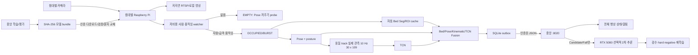

# DMC_POSE 중앙 사전 배포 완료 상태

기준일: 2026-08-07  
중앙 서버: `192.168.0.108`  
프로젝트: `/home/dmc/AI/DMC_POSE`

## 결론

중앙 서버에서 할 수 있는 사전 준비는 완료됐다. 기존 `:8000` 6카메라 파이프라인은
reference/shadow로 계속 실행하며, 새 `:8020`은 Pi의 heartbeat·추론값·사건·선택적
증거 프레임과 모델 번들만 처리한다. 상시 RTSP 원본을 중앙으로 보내는 구조가 아니다.

후보 모델은 변환·동등성·체크섬 검증까지 통과했지만 상태는 의도적으로
`benchmark_required`다. 실제 Pi의 CPU/RAM/가속기/온도/지연을 측정하기 전에는
자동 활성화되지 않는다.

## 최종 데이터 흐름



## 실행 서비스

| 포트 | 역할 | 상태 |
|---|---|---|
| `8000` | 기존 6카메라 reference/shadow viewer와 상태 | 유지, 회귀 PASS |
| `8010` | FallVision annotation UI | 유지 |
| `8020` | 인증된 edge control plane v2 | 실행 중 |

`:8020`의 health endpoint를 제외한 API는 Bearer 인증이 필요하다. 토큰은
`runtime_data/edge_control/api_token`에 mode `0600`으로 있고, 소스·문서·handoff ZIP에는
포함하지 않는다.

## 검증 결과

- 전체 단위 테스트: `170 passed`
- temporal contract: `109 features`, observed-only, missing/copy 금지 PASS
- 6카메라 capture: 약 20 FPS
- watcher: 약 18~20 FPS
- 자동 Bed ROI: 6/6 READY, refresh 후 segmentation throttle PASS
- EMPTY 카메라 Pose probe: 약 0.83 FPS
- scheduler: mailbox backlog 0, 오류/drop 0, thread 6/6 alive
- primary track = TCN owner = fusion owner 불변식 PASS
- secure API: 무인증 401, 비허용 artifact 404, 잘못된 JPEG 409
- 모델 5개 전체 인증 다운로드와 SHA-256 재검증 PASS
- Pi agent 실코드 heartbeat: `sent=1`, durable outbox `pending=0`
- 후보 번들 자동 활성화 차단 PASS
- CANDIDATE/FALL 사건만 bounded 2차 큐로 전달하고, canary 동안 기존 중앙
  reference 결과와 업로드 증거 프레임을 사건 단위로 교차검증한다. 새 상시 RTSP는
  열지 않는다.

## 모델 및 데이터 판정

- GMDCSA observed-only v2는 입력 계약 정합에는 성공했다.
- 현재 event 오탐률 때문에 새 TCN은 production 승격하지 않았다.
- FallVision 수동 temporal annotation 24개는 frozen external diagnostic이다.
- weak 72개와 non-fall 36개는 train-only이며 subject-safe split이 아니므로 승격 근거가 아니다.
- 라이브 모델은 기존 shadow를 유지한다.

후보 edge bundle:

```text
rpi5-onnx-candidate-v1
status=benchmark_required
bed_seg.onnx
yolo11n-pose.onnx
posture_six_fp32.tflite
fall_tcn_normalized.onnx
edge_fusion.json
```

Pose ONNX의 confidence 분포가 원본 PT와 달라 중앙 실험에서는 `conf=0.1` 후보를
사용했다. 이 값은 Pi 실제 영상 benchmark에서 다시 calibration해야 한다. Bed Seg는
`conf=0.5` 후 PT와 높은 일치를 보였다.

## 남은 외부 게이트

중앙 코드 작업이 아니라 실제 기기 접근이 필요한 항목이다.

1. 제작자로부터 Pi Linux 사용자/SSH 키 또는 비밀번호 확보
2. `.161` 한 대를 읽기 전용 probe하여 Pi 4/5, RAM, 가속기, RTSP 서비스 확인
3. 기존 RTSP를 변경하지 않고 heartbeat-only canary
4. 후보 5개를 staging만 하고 30분 latency/RAM/온도 benchmark
5. 중앙-vs-Pi 동일 영상 출력 비교
6. bundle을 `shadow`로 새 버전 발행 후 24시간 canary
7. 네트워크 단절·재부팅·rollback 시험 후에만 production 승격

SSH 계정을 모르는 상태에서 포트 22와 RTSP 접근만으로 Linux 배포는 할 수 없다.
RTSP 인증 성공은 영상 읽기 권한이지 운영체제 파일·서비스 변경 권한이 아니다.

## 운영 명령

```bash
# 기존 영상/추론 상태
curl http://127.0.0.1:8000/status

# edge API health (인증 불필요)
curl http://127.0.0.1:8020/health/ready

# 인증 smoke 및 전체 번들 검증
python3 scripts/smoke_secure_edge_control.py

# 전체 회귀
python3 -m pytest -q
python3 scripts/check_phase3_runtime.py --seconds 10
python3 scripts/check_auto_bed_roi.py --settle-seconds 8
python3 scripts/check_phase4_scheduler.py --seconds 10
python3 scripts/check_phase5_tracking.py --seconds 5
python3 scripts/check_phase6_fusion.py --seconds 10
```
