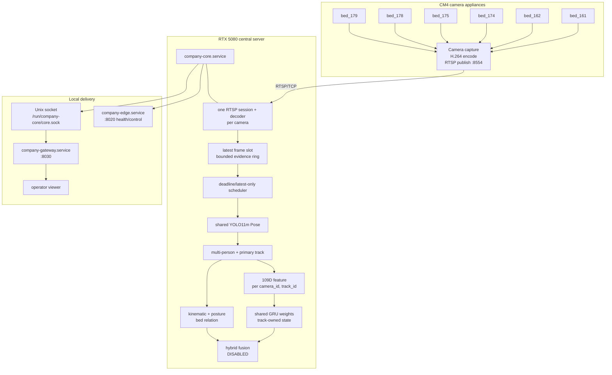
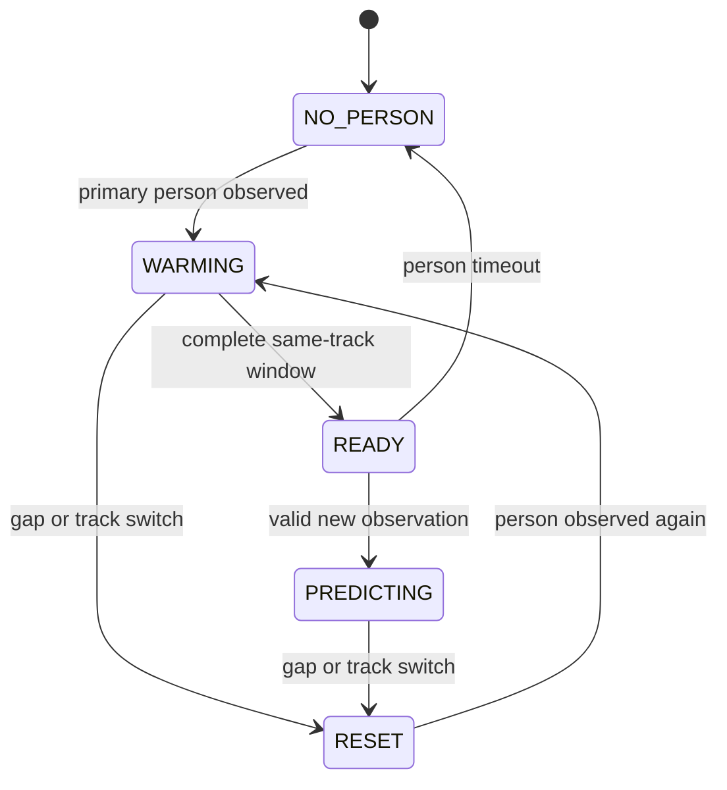

# DMC POSE current architecture

Status date: 2026-08-28
Authority: `telemetry_only`
Live alert authority: disabled

This document is the canonical description of the current target and deployed
shadow boundary. Historical Phase documents describe how the project arrived
here; they are not deployment instructions.

## Physical and service topology



## Ownership contract

```text
RTSP connection      exactly 1 per camera
decoder              exactly 1 per camera
shared model weight  exactly 1 per model
latest frame         exactly 1 current slot per camera
temporal state       one per (camera_id, track_id, route)
missing observation  never copied or manufactured
```

Viewer, recorder, and model routes must consume the central frame owner; they
must not reopen RTSP independently.

## Deployed and staged model routes

| Route | Contract | State | Authority |
|---|---|---|---|
| Central GRU default | `80 x 109 @ 20Hz`, 4 s | deployed shadow bundle | telemetry only |
| Central small GRU | `40 x 109 @ 10Hz`, 4 s | deployable alternative | telemetry only |
| Legacy TCN | `30 x 109 @ 10Hz`, 3 s | baseline/fallback evidence | shadow only |
| Swin3D-B | RGB candidate verifier | offline/staged with 10Hz bundle | no alert authority |
| Bed segmentation | central shared weight | available | context only |
| YOLO11m Pose | central shared weight | available | feature source |
| Six-class posture | central Keras weight | available | context only |

The two GRU deployments are alternatives, not simultaneous live routes.
`deploy-shadow` selects the 20Hz bundle; `deploy-shadow-10hz` selects the
10Hz bundle. Both explicitly keep Fusion disabled.

## Live status interpretation

A camera with no observed person correctly reports zero samples and no
prediction. Temporal evaluation begins only after a stable primary track fills
the complete window.



For the default route, readiness requires 80 valid rows at the frozen 20Hz
contract. The observed 2026-08-28 status had six RTSP sessions, no scheduler
errors, and roughly 10–13 Pose inferences/s while all beds were empty. It did
not prove temporal readiness or fall recall.

## Remaining promotion blockers

1. Sustain the chosen cadence with a person present.
2. Preserve person/Pose/track through fast floor transitions.
3. Demonstrate samples filling, `ready=true`, and predictions increasing.
4. Build subject/session-safe validation and test evidence.
5. Reduce false positives; current diagnostic GRU reports are not promotion
   evidence.
6. Complete valid-bed-hour shadow soak and explicit safety review.
7. Enable Fusion or real ALERT only through a separate reviewed change.

## CM4 boundary

The central server retains all fall authority and heavy inference. The CM4
handoff adds only capture/encode/RTSP plus lightweight scene, ROI, motion, and
ring-health telemetry. Those signals may wake or diagnose the central pipeline;
they cannot emit a final fall decision. The handoff is built but installation
on each Pi is a separate deployment step.
