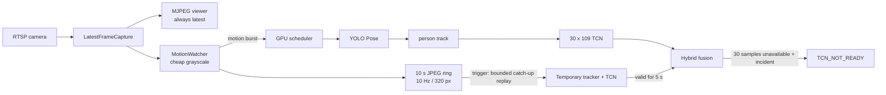

# Current Plan & Device Specs (2026-07-28)

## 1) 목표 요약

- 다중 병상 카메라 운영에서 서버/GPU 부하를 줄이면서 낙상 감지 정확도를 유지
- 상시 고FPS/고비용 추론 대신 **이벤트 기반 트리거 추론**으로 전환
- 구조: **침대별 엣지 디바이스(Raspberry Pi 5) + 중앙 서버 1대**

---

## 2) 현재 확인된 사실

### 모델 현황

- 현재 분류 모델: `my_model_six_check.keras`
- 입력/출력 shape:
  - Input: `(None, 34)`
  - Output: `(None, 6)`
- 해석: 현재 6-class 모델은 **단일 프레임 키포인트 기반 분류**이며, 아직 진짜 시계열 모델(LSTM/TCN 등)은 아님

### 카메라 구성 (현재 코드 기준)

- `bed_161`: `rtsp://192.168.0.161:8554/stream`
- `bed_162`: `rtsp://192.168.0.162:8554/stream`
- `bed_174`: `rtsp://192.168.0.174:8554/stream`
- `bed_175`: `rtsp://192.168.0.175:8554/stream`
- `bed_178`: `rtsp://192.168.0.178:8554/stream`
- `bed_179`: `rtsp://192.168.0.179:8554/stream`

---

## 3) 서버/디바이스 스펙

## 중앙 서버 (실측)

- Hostname: `dmc-MS-7D77`
- OS: Ubuntu 24.04.4 LTS
- CPU: AMD Ryzen 7 9800X3D 8-Core Processor
- vCPU(논리 코어): 16
- RAM: 30 GiB (available 약 24 GiB)
- GPU: NVIDIA GeForce RTX 5080 (VRAM 16,303 MiB)
- NVIDIA Driver: 595.71.05

## 엣지 디바이스 (계획)

- 침대별 1대: Raspberry Pi 5
- 역할:
  - 평시 저비용 모션/변화 감지
  - 짧은 프레임 버퍼 유지
  - 이벤트 시에만 서버로 burst 업로드

---

## 4) 확정 전략 (하이브리드 분산, v2)

## 역할 분리

- **엣지(Pi 5)**:
  - 카메라 수신/디코딩은 10~15 FPS 유지
  - 저비용 변화 감지는 축소 그레이스케일(예: 320x180)에서 5~10 FPS 수행
  - 이벤트 트리거 생성
  - pre-event 버퍼 + live/post-event 스트림 전송
- **중앙 서버(RTX 5080)**:
  - 이벤트 구간만 고비용 추론(세그/포즈/분류)
  - 낙상 판단/알림 최종 결정

## 상태 흐름

1. `IDLE`: 저비용 감시 + ring buffer 유지
2. `TRIGGER_CANDIDATE`: 0.3~1.0초 지속 여부 확인(노이즈 제거)
3. `ACTIVE_ANALYSIS`: 서버에 pre/live 프레임 전송 + 실시간 분석
4. `POST_EVENT`: 이벤트 후 5~10초 추가 분석(낙상 후 무동작 탐지)
5. `COOLDOWN`: 10~30초 재트리거 억제 후 IDLE 복귀

## 4.1) 중앙 서버 선행 구현 상태 (2026-08-03)

- `MotionWatcher`가 카메라별로 10초/10Hz JPEG pre-event ring을 유지한다.
- ring은 640px, JPEG quality 70이 기본이며 `/status`와 viewer에서 프레임 수,
  시간 coverage, 메모리 사용량, ready 여부를 확인할 수 있다.
- 최신 영상 슬롯과 ring 저장은 분리되어 있어 Pose/TCN 지연이 MJPEG viewer를
  막지 않는다.
- 빠른 움직임 또는 구조적 위험이 관측됐지만 TCN 30개 실제 관측이 아직 없으면
  fusion은 `SAFE`가 아니라 `TCN_NOT_READY`를 출력한다.
- ring은 실제 capture timestamp로 최대 20Hz를 보존한다. TCN runner가 70ms보다
  빠른 관측은 건너뛰므로 synthetic row 없이도 한두 번의 Pose 누락을 견딘다.
- motion trigger가 발생했는데 live TCN 문맥이 준비되지 않았으면 최근 8초,
  최대 150프레임을 임시 tracker/TCN으로 catch-up replay한다.
- replay는 8프레임 GPU batch로 분할되고 총 6초 budget을 갖는다. 중앙 scheduler가
  각 batch 사이에서 다른 카메라 요청을 선택할 수 있으므로 한 카메라가 GPU를
  장시간 독점하지 않는다.
- replay 결과는 live runner에 과거 timestamp를 삽입하지 않고, 5초 동안 독립된
  temporal source로 fusion에 제공된다.
- motion이 작아도 EMPTY probe가 사람을 처음 발견하면 최근 8초 ring replay를
  자동 실행한다. track ID가 흔들려도 카메라별 10초 간격으로만 재시도해 GPU
  부하를 제한한다.
- Pose 사람 검출 임계값은 `POSE_PERSON_CONF=0.5`를 기본으로 사용한다. 빈 병실
  실측에서 0.25 이하의 약한 가짜 사람 후보가 관측되어 낮은 임계값은 운영
  기본값으로 사용하지 않는다.
- 과거 문맥 replay는 live 경보 입력이 아니라 observed Pose 복원용이므로
  `POSE_REPLAY_PERSON_CONF=0.25`를 사용한다. 중앙 scheduler와 동일 model lock을
  사용하며, live primary가 없으면 replay만으로 경보를 승격하지 않는다.



---

## 5) 낙상 오탐 억제 전략 (합의안)

- `body_in_bed_ratio >= 0.8` + 안전 pose는 **hard veto(완전 무효)**가 아니라 **fall score 감점**으로 적용
- 목적:
  - 침대 내부 정상 자세(눕기/중앙 앉기)에서 불필요한 낙상 오탐 감소
- 안전 게이트 해제 조건(우선순위 높음):
  - 급격한 중심점 하강
  - torso angle 급변
  - bed edge 방향 centroid 이동
  - floor ROI 진입
  - `sitting_edge`/`lying_edge` 등 위험 자세 전이
  - 하강 이후 저움직임 지속

---

## 6) 트리거 품질 설계 (Pi 5)

- 단일 `frame_diff > threshold` 대신 복합 점수 사용:

```text
event_score =
    motion_area_ratio
  + motion_intensity
  + bed_roi_weight
  + downward_motion_score
  + persistence_score
```

- ROI 분리:
  - `BED_ROI`
  - `BED_EDGE_ROI`
  - `FLOOR_ROI`
  - (선택) `ENTRY_ROI`

- 트리거 기준:
  - `TRIGGER_CANDIDATE`에서 N프레임(또는 T초) 연속 조건 충족 시 `ACTIVE_ANALYSIS`

---

## 7) 업링크/통신 설계

- 제어/상태(HTTP REST):
  - `POST /edge/heartbeat`
  - `POST /events/start`
  - `POST /events/end`

- 프레임 스트림(WebSocket 권장):
  - `WS /events/{event_id}/frames`

- 이벤트 전송 시퀀스:
1. `event_start` 전송
2. pre-event 프레임 순차 전송
3. live 프레임 지속 전송
4. `event_end` 전송
5. 서버 최종 결과 응답

- 프레임 메타 필수값:
  - `event_id`, `camera_id`, `frame_seq`
  - `capture_ts`(필수), `send_ts`

---

## 8) 단계별 실행 계획

## Phase A (우선, 구현 시작점)

- 이벤트 기반 업링크(상시 스트리밍 → 트리거 전송) 전환
- `TRIGGER_CANDIDATE/POST_EVENT/COOLDOWN` 상태기계 확정
- heartbeat + event session API 확정
- 네트워크 장애 시 로컬 저장/재전송 정책 포함

## Phase B

- `body_in_bed_ratio + pose class` 감점 게이트 적용/튜닝
- 병상별 임계치(모션, idle timeout, burst 길이) 분리 설정

## Phase C

- 현재 34차원 단일프레임 분류 유지 + 서버 시계열 규칙 특징 추가
  - `centroid_y_velocity`, `torso_angle_velocity`
  - `bed_overlap_change`, `floor_overlap`
  - `pose_transition`, `motion_after_descent`
- 이후 실제 시계열 모델(LSTM/TCN/Transformer) 교체 검토
- 학습/검증 파이프라인 정비

## Phase D

- 공용 모델 1회 로드 + 멀티카메라 이벤트 배치 스케줄러 구조로 전환
- 운영 KPI 대시보드화
- 병상 수 확장 테스트 및 장애 대응 자동화

---

## 9) KPI (성공 기준)

- 평시 GPU 사용률 대폭 감소
- 이벤트 미발생 병상의 네트워크 전송량 최소화
- 낙상 민감도 유지 + 오탐 감소
- 동시 이벤트 기준 성능 보장:
  - max concurrent active events
  - event queue wait time
  - trigger-to-first-inference latency
  - trigger-to-alert latency
  - dropped frame ratio
  - event upload failure ratio

---

## 10) heartbeat 필수 항목

- `camera_connected`, `capture_fps`, `buffer_sec`
- `cpu_percent`, `memory_percent`, `temperature_c`
- `disk_free_mb`, `last_event_ts`, `software_version`
- 서버에서 병상별 설정값 하향식 배포 지원:
  - `motion_threshold`, `trigger_hold_ms`
  - `pre_event_sec`, `post_event_sec`, `cooldown_sec`
  - `jpeg_quality`, `analysis_fps`, `ROI 좌표`

---

## 11) 네트워크 장애 대응 (Phase A 포함)

- 서버 연결 끊김 감지
- 이벤트 로컬 임시 저장
- 재연결 후 재전송
- 저장 용량 초과 시 중요도 기반 정리
- 이벤트 ID 기반 중복 전송 방지
- 권장 상태:
  - `SERVER_OFFLINE`
  - `LOCAL_RECORDING`
  - `RETRY_UPLOAD`

---

## 12) 2026-08-03 실시간 런타임 입력 계약 및 검증 결과

### 영상 표시와 분석 경로 분리

- `/viewer`, `/video/{camera_id}`, `/image/{camera_id}`는 원본 카메라 프레임을 표시한다.
- 브라우저 표시 경로는 Pose/TCN 추론 완료를 기다리지 않는다.
- 서버 분석 프레임만 현재 설치 각도에 맞춰 시계 방향 90도로 회전한다.
- 자동 침대 ROI도 분석 좌표계에서 생성하며, 기존 원본 좌표 캐시와 분리된 회전별 캐시를 사용한다.

### 사람 관측과 부하 제어

- YOLO Pose의 낮은 confidence 출력은 후보 생성에만 사용한다.
- 실제 사람 관측으로 채택하려면 현재 기준 `box confidence >= 0.5` 및 프레임 면적 `>= 2.5%`를 만족해야 한다.
- 이 최소 면적 조건으로 빈 병실의 침구·장비를 사람으로 오인하던 작은 박스를 제거한다.
- 사람이 없는 카메라는 `EMPTY/idle`로 내려가며, 저빈도 probe만 수행한다.
- 사람이 관측되는 카메라는 캡처 monotonic timestamp 기준 약 0.09초 간격으로 Pose 분석을 요청한다.

### TCN observed-only 계약

- TCN 입력은 동일 primary track에서 **현재 프레임에 실제 관측된 skeleton**만 사용한다.
- tracker TTL에 남은 과거 skeleton, 이전 프레임 복사, zero/missing row는 TCN에 넣지 않는다.
- track 변경 또는 허용 범위를 벗어난 시간 gap에서는 temporal buffer를 reset한다.
- offline 추출 기본 cadence는 70~150ms다. 라이브는 다중 카메라 scheduler jitter를 수용하기 위해 70~250ms의 실제 관측을 허용하며, 중간 skeleton이나 missing row를 생성하지 않는다.
- 연속 실제 관측 30개가 모이면 `tcn_shadow_ready=true`가 된다.
- 사람이 지속적으로 잘 관측되면 ready 도달 예상 시간은 약 3~4초다.

### 상태 API에서 확인할 필드

```text
person_count
analysis_state
primary_track_id
primary_track_observed
tcn_samples
tcn_shadow_ready
tcn_last_dt_sec
tcn_last_action
tcn_duplicate_skip_total
tcn_non_monotonic_skip_total
tcn_gap_reset_total
```

정상적인 사람 관측 시 기대 흐름:

```text
person_count: 0 -> 1
analysis_state: idle -> tracking
primary_track_observed: true
tcn_samples: 1 -> ... -> 30
tcn_last_dt_sec: 보통 약 0.10~0.15, 순간 scheduler jitter는 최대 0.25
tcn_last_action: append
tcn_shadow_ready: false -> true
```

### 현재 확인된 수용 결과

- 6대 카메라 모두 빈 병실 상태에서 `person_count=0`, `mode=EMPTY`, `analysis_state=idle`, `tracks=0` 확인.
- 같은 상태에서 capture와 자동 bed ROI는 정상(`capture=true`, ROI `READY`).
- Pose 요청 burst로 발생하던 수 ms duplicate 뒤 150ms 초과 gap 문제를 캡처 시간 기반 pacing으로 제거.
- 원본 viewer 속도와 분석/TCN 경로의 독립성 유지.
- 전체 단위 테스트 110개 통과.
- 현장 재관측에서 실제 사람 skeleton 30개가 축적되어 `tcn_shadow_ready=true`로 전환되는 것을 확인.
- 사람이 사라진 직후 full buffer가 남아 있더라도 `primary_track_observed=false`와 fusion `INSUFFICIENT`가 경보를 차단한다.

현재 빈 병실 또는 연속 관측이 끊긴 병상에서 `ready=false`인 것은 정상 동작이다. 사람이 이동하거나 가려져 track/gap 경계를 넘으면 buffer가 다시 1부터 쌓이는 것이 observed-only 계약의 의도된 동작이다.
