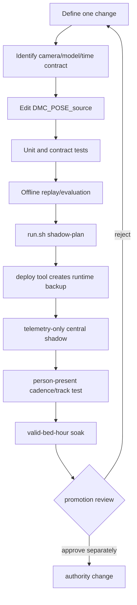

# DMC POSE developer guide

## Repository roles

| Path | Role | Rule |
|---|---|---|
| `/home/dmc/AI/DMC_POSE` | operator surface | service control and approved deploy tools only |
| `/home/dmc/AI/DMC_POSE_source` | source, tests, training, docs | development happens here |
| `/opt/.company-core/runtime` | protected deployed runtime | never edit manually |
| `/var/lib/.company-core/backups` | deploy rollback copies | created by deploy tooling |

The source tree intentionally has no root Git metadata at this snapshot.
Do not assume `git checkout` can recover a mistake. Create an external backup
and hash manifest before structural cleanup.

## Start here

```bash
cd /home/dmc/AI/DMC_POSE_source
PYTHONDONTWRITEBYTECODE=1 pytest -p no:cacheprovider -q

cd /home/dmc/AI/DMC_POSE
./run.sh help
./run.sh status
./run.sh shadow-plan
./run.sh shadow-plan-10hz
```

Expected test baseline on 2026-08-28: `319 passed, 1 skipped`.

## Development flow



No training or evaluation command changes the live service automatically.

## Important source areas

| Area | Files/directories |
|---|---|
| central orchestration | `server_all_cameras.py`, `latest_frame_capture.py`, `inference_scheduler.py` |
| tracking/features | `person_tracker.py`, `pose_candidate_filter.py`, `temporal_features.py`, `temporal_sequence.py` |
| temporal inference | `temporal_model.py`, `live_temporal.py`, `train_tcn.py` |
| event context | `motion_watcher.py`, `spatial_geometry.py`, `bed_monitor/`, `hybrid_fusion.py` |
| video verifier | `swin3d_verifier.py`, `video_verifier_runtime.py`, `scripts/finetune_swin3d_site.py` |
| CM4 appliance | `edge_site_runtime.py`, `edge_motion_watcher.py`, `edge_node_agent.py` |
| tests | `tests/` |
| protected builds | `build/protected_shadow_*` |
| model/data evidence | `runs/`, `external_models/`, `external_datasets/`, `runtime_data/` |

## Safe change checklist

1. Read [CURRENT_ARCHITECTURE.md](CURRENT_ARCHITECTURE.md).
2. Keep the model's exact FPS, row count, feature schema, and missing-row rules.
3. Add or update tests.
4. Run the full test suite without creating caches.
5. Run both shadow plans; a plan is read-only.
6. Never copy a model file without its report and expected hash.
7. Deploy only through `/home/dmc/AI/DMC_POSE/run.sh`.
8. Confirm six cameras, one RTSP each, scheduler errors 0, and service restarts 0.
9. Test with a real observed person before claiming temporal readiness.
10. Keep authority telemetry-only until a separate promotion review.

## Site fine-tuning

Use a new site run directory; never overwrite the general base checkpoint.

```bash
cd /home/dmc/AI/DMC_POSE
./site-finetune.sh check <manifest.json> [run-name]
./site-finetune.sh train <manifest.json> <run-name> [epochs]
```

The manifest must keep person/session groups disjoint. A missing test set blocks
promotion. See [SITE_FINETUNE_QUICKSTART.md](SITE_FINETUNE_QUICKSTART.md).

## CM4 handoff

```bash
cd /home/dmc/AI/DMC_POSE_source
python scripts/build_cm4_camera_handoff.py
```

The archive intentionally excludes API tokens, SSH credentials, RTSP
credentials, frames, video, and optional Pose weights. Provision secrets
separately with mode `0600`.

## Never delete during routine cleanup

- `runs/`
- `external_models/`
- `external_datasets/`
- `runtime_data/`
- `build/`
- `*.pt`, `*.pth`, `*.onnx`, `*.keras`
- protected runtime binaries or deployment backups

Only generated caches and superseded handoff bundles are routine cleanup
candidates, and only after regression testing.
