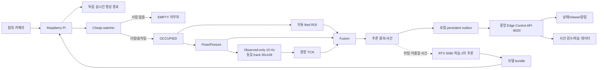

# DMC_POSE Edge-first 하이브리드 아키텍처 v1

상태: **구현 중 / Pi 벤치마크 전**  
결정일: 2026-08-07  
기준 저장소: `/home/dmc/AI/DMC_POSE`  
중앙 서버: `192.168.0.108` (`dmc-MS-7D77`)

> 이 문서는 2026-07-31의 "Pi는 RTSP만 송출" 결정을 대체한다. 기존 중앙
> 파이프라인은 폐기하지 않고 reference/shadow/2차 추론 경로로 유지한다.

## 1. 고정된 의도

침대마다 카메라와 Raspberry Pi 한 대가 배치된다. Pi는 카메라와 가장 가까운
곳에서 저지연 1차 추론을 수행한다. 큰 중앙 서버는 학습, 모델 배포, 전체 병상
집계, 장기 분석, 선택적 2차 정밀 추론을 수행한다.

이 설계의 목적은 중앙 서버를 사용하지 않는 것이 아니다. 중앙 서버가 모든
RTSP를 항상 디코딩하는 반복 비용을 줄이고, RTX 5080 자원을 학습과 위험 사건의
정밀 재검증에 집중시키는 것이다.

## 2. 실제 서버 자원과 역할

2026-08-07 확인 사양:

| 항목 | 값 |
|---|---|
| IP | `192.168.0.108` |
| CPU | AMD Ryzen 7 9800X3D, 8C/16T |
| RAM | 약 32 GB |
| GPU | NVIDIA GeForce RTX 5080 |
| 프로젝트 | `/home/dmc/AI/DMC_POSE` |

중앙 서버 책임:

1. 공개·자체 데이터 정리와 학습/재학습
2. Bed Seg, Pose, Posture, TCN의 정밀 평가와 경량 포맷 변환
3. checksum을 포함한 승인 모델 bundle 배포
4. 모든 Pi heartbeat, 최신 추론값, 사건 메타데이터 통합
5. 중앙 Viewer, 알림, 장기 운영 지표와 hard-negative 검수
6. 낮은 품질·높은 위험 사건의 선택적 GPU 2차 추론
7. Pi 장애 시 제한된 카메라에 대한 중앙 fallback

Pi 책임:

1. 한 침대의 카메라 캡처와 RTSP/로컬 viewer 영상 경로
2. 사람이 없을 때 저비용 watcher와 저주기 probe
3. 자동 Bed Seg/ROI bootstrap, cache, scene-change refresh
4. 사람이 있을 때 Pose, posture, 실제 관측 10 Hz 시계열 생성
5. 동일 track의 관측 30개만 사용한 `30x109` TCN
6. Bed relation + kinematic + Pose + TCN fusion
7. 네트워크 단절 중 로컬 판단과 결과 outbox 보관
8. 상시 원본 영상이 아닌 결과값·heartbeat·사건 구간만 전송

## 3. 런타임 흐름



원본 Mermaid 파일: `docs/architecture_v2/12_edge_first_runtime_flow.mmd`

## 4. 부하 상태 머신

| 상태 | 실행 내용 | 목표 |
|---|---|---|
| `EMPTY` | capture + watcher + 저주기 person/ROI probe | 상시 부하 최소화 |
| `OCCUPIED` | Pose와 10 Hz 실제 관측 수집 | 안정적인 문맥 준비 |
| `BURST` | 급격한 움직임 시 Pose/kinematic/fusion 고주기 | 낙상 전이를 놓치지 않음 |
| `DEGRADED` | ROI/모델/카메라 품질 저하 표시, 제한 판정 | 거짓 확신 방지 |

중요 규칙:

- Viewer 접속 수가 추론 FPS를 바꾸지 않는다.
- 사람이 없으면 TCN window를 만들지 않는다.
- track 변경, 150 ms 초과 gap, 비단조 timestamp에서 과거 window를 잇지 않는다.
- zero missing row와 이전 skeleton 복사를 금지한다.
- 침대 밖에 있다는 사실만으로 `FALL`을 확정하지 않는다.
- `BED_EXIT`, `FALL`, `BED_EXIT_FALL`을 별도 사건으로 유지한다.

## 5. Pi와 서버 사이의 계약

구현 파일:

| 파일 | 역할 |
|---|---|
| `edge_contract_v1.py` | 엄격한 heartbeat/result/event/model 계약 |
| `edge_registry_v1.py` | 순서·중복·event owner 검증과 비동기 JSONL 기록 |
| `edge_control_server.py` | 독립 FastAPI 제어면, 기본 포트 8020 |
| `config/edge_model_bundle_v1.json` | 현재 배포 bundle 상태 |
| `temporal_candidate_recorder.py` | 후보 `30x109` feature-only 자동 기록 |

API:

```text
POST /edge/heartbeat
POST /edge/results
POST /events/start
POST /events/end
GET  /edge/nodes
GET  /edge/model-manifest
GET  /health/live
GET  /health/ready
```

보안·개인정보 계약:

- heartbeat/result에 `rtsp_url`, password, 원본 frame을 허용하지 않는다.
- timestamp는 timezone을 반드시 포함한다.
- `(node, camera, boot)` 안에서 sequence/frame sequence가 뒤로 가면 409다.
- 동일 패킷 재전송은 idempotent하게 성공시킨다.
- 이벤트 종료는 시작과 동일한 node/camera/boot여야 한다.
- 운영 전에는 mTLS 또는 장치별 서명 인증을 추가해야 한다.

## 6. 가중치 배포 원칙

현재 `config/edge_model_bundle_v1.json`의 상태는 의도적으로
`benchmark_required`이고 artifacts는 비어 있다. 서버용 `.pt/.keras` 파일을 Pi에
그대로 복사해서 production이라고 부르지 않는다.

승격 흐름:

```text
서버 checkpoint 고정
→ ONNX/TFLite/NCNN 후보 변환
→ 서버에서 출력 동등성 검사
→ 실제 Pi에서 1카메라 latency/온도/RAM 측정
→ shadow bundle
→ 한 침대 canary
→ 자동 rollback 검증
→ production bundle
```

각 artifact는 filename, 역할, format, byte size, SHA-256를 가진다. Pi는 다운로드
후 checksum과 feature schema를 검증하고, 새 bundle을 임시 디렉터리에서 smoke
test한 뒤 원자적으로 활성화해야 한다. 실패하면 이전 bundle을 유지한다.

## 7. 중앙 8000과 새 8020의 관계

| 포트/경로 | 현재 역할 |
|---|---|
| `:8000/viewer` | 기존 6카메라 reference/shadow viewer |
| `:8000/status` | 기존 중앙 추론 상태 |
| `:8010` | FallVision temporal annotation UI |
| `:8020` | 새 Pi control-plane API |

8000은 Pi 전환이 검증될 때까지 유지한다. 8020은 영상 스트리밍 서버가 아니며
작은 JSON 추론값과 사건 상태를 받는다.

## 8. 검증 게이트

### Gate A — 계약과 저장

- 전체 단위 테스트 통과
- 잘못된 shape, naive timestamp, secret 필드 거부
- 중복 전송 idempotent, sequence regression 거부
- `30x109 float32` 후보만 저장

### Gate B — Pi 단일 카메라 benchmark

- capture가 장시간 안정적이고 backlog가 없음
- EMPTY/OCCUPIED/BURST 상태 전환 확인
- 실제 관측 10 Hz cadence와 reset 규칙 확인
- 온도 throttling 없음, 메모리 증가 없음
- Viewer 유무가 추론 지연에 영향 없음

### Gate C — 중앙/엣지 동등성

- 같은 녹화 입력에 대해 Pose/TCN/fusion 결과 비교
- 허용 오차와 event timing 차이를 명시
- 정상 눕기, 줍기, 쪼그리기, 바닥 앉기 오탐 확인
- staged fall의 coverage, conditional recall, latency 측정

### Gate D — canary와 확장

- 한 침대 shadow 24시간
- 한 침대 alert shadow 7일
- 장애/네트워크 단절/재부팅/rollback 시험
- 기준 충족 후 침대별 순차 확장

## 9. 현재 완료와 다음 작업

완료:

- 중앙 6카메라 baseline과 30초 soak 정상
- observed-only `30x109` 계약
- Pi↔서버 v1 wire contract와 수신 API
- 비동기 중앙 audit 기록과 feature-only 후보 기록
- 배포 전 상태를 거짓 승격하지 않는 manifest

다음:

1. Pi persistent outbox와 재전송 client
2. 서버 모델 bundle 검증/원자적 설치 manager
3. 실제 Pi 사양 확인 및 1카메라 benchmark
4. 경량 Bed Seg/Pose/TCN artifact 생성
5. 동일 영상 중앙-vs-Pi replay 비교
6. 한 침대 shadow canary

