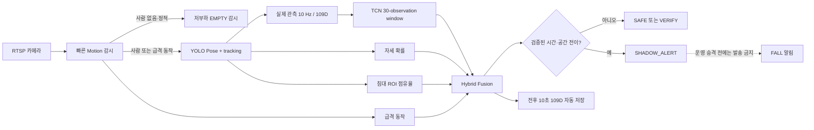

# 낙상 감지 실사용 준비도 — 2026-08-14

## 결론

현재 시스템은 **실시간 Shadow 검증과 자동 데이터 수집에는 사용 가능**하다. 그러나
병실에서 실제 경보를 자동 발송하는 production 시스템으로는 아직 승격하지 않는다.

| 사용 단계 | 현재 가능 여부 | 의미 |
|---|---:|---|
| 개발/재생 시험 | 가능 | 단위 테스트, 녹화 자료 재생, API 확인 |
| 실시간 Shadow | 가능 | 카메라를 보며 판정값을 기록하지만 외부 경보는 발송하지 않음 |
| 감독형 현장 파일럿 | 조건부 | v6 online 양성·음성 시험과 장시간 오탐 시험 통과 후 가능 |
| 무인 실운영 경보 | 불가 | 현장 통계, 장애·복구, 알림 연동 및 안전 검증이 아직 부족 |

`hybrid_v6_direct_rapid_bed_departure`는 실제 모사 기록의 오프라인 재생에서 최종
`SHADOW_ALERT`를 발생시켰고, 이전 정상 이탈 기록에서는 alert 0건이었다. 최신 전체
회귀 테스트 231개도 통과해 서버에 반영했다. 다만 이는
recorded-live replay gate 통과이며, 재시작된 v6 서버에서의 online 반복 시험과 장시간
오탐 시험은 아직 남아 있다.

## 사용자가 보게 될 결과와 내부 판단값

자세 분류를 버리는 것이 아니다. 자세, keypoint, 침대 위치 등은 내부 판정에 사용하되
운영자가 보는 최종 결과를 낙상 중심으로 단순화한다.

| 계층 | 값 | 용도 |
|---|---|---|
| 외부 운영 결과(목표) | `SAFE`, `FALL_CANDIDATE`, `FALL` | 모니터링·알림·이벤트 저장 |
| 내부 상태 | `WARMING`, `CANDIDATE`, `VERIFY`, `SHADOW_ALERT` 등 | 디버깅과 승격 판단 |
| 내부 증거 | TCN 확률, 급격 동작, 자세 확률, 침대 점유율, Pose 누락·재검출 | 하이브리드 판정 |
| 원시 관측 | 17개 skeleton, confidence, track, capture timestamp | 109D 시계열 생성 |

현재 API는 아직 내부 `fusion_phase`를 그대로 노출한다. 따라서 `SHADOW_ALERT`는
`FALL` 후보에 해당하지만 실제 보호자/병원 알림을 발송하지 않는다.

## 현재 이벤트 판정 흐름



### v6에서 FALL을 확정할 수 있는 경로

| 경로 | 필요한 증거 | 설명 |
|---|---|---|
| 빠른 낙상 | TCN 지속 + 급격 동작 + 자세/운동학 구조 확인 | 기존 구조적 확인 경로 |
| 느린 낙상 | TCN 지속 + 운동학 변화 + 사건 후 낮은/누운 자세 | 빠른 motion이 없어도 가능 |
| 침대 이탈 낙상 | 검증된 TCN+급격 동작 + 짧은 Pose 소실 + 같은 track 재검출 + 점유율 `>=0.80 → <=0.25`가 3.5초 이내 발생 | 이번 v4 추가 경로 |
| 순차 침대 낙상 | 최근 침대 안 상태 + TCN 지속 + 가장자리의 누운 자세 + 2초 이내 침대 밖 확인 | 서로 다른 프레임의 증거를 하나의 ordered event로 결합하는 v5 경로 |
| 직접 급격 이탈 | 침대 안에서 TCN 지속+motion burst가 함께 시작되고, 2초 이내 점유율이 `<=0.25`로 하강 | 자세가 `sitting_edge`로 오분류돼도 이벤트 운동학으로 확인하는 v6 shadow 경로 |

침대 이탈 낙상 경로는 다음 안전장치를 가진다.

- 단순 점유율 감소만으로 경보하지 않는다.
- `VERIFY` 이전 Pose 누락은 유지하지 않는다.
- Pose가 없는 동안에는 `FALL`로 승격하지 않는다.
- track이 바뀌거나 1.5초 유예가 끝나면 사건 기억을 폐기한다.
- 정상 침대 이탈처럼 Pose 소실이 없는 경우 `rapid_bed_departure`를 만들지 않는다.
- 자세값은 단독 결정값이 아니라 추가 증거로 계속 사용한다.

## 구성요소별 준비 상태

| 구성요소 | 상태 | 확인 근거 | 남은 일 |
|---|---|---|---|
| 6대 RTSP 캡처 | PASS | 서버에서 capture 연결 및 viewer 제공 | 장시간 reconnect 통계 |
| 빠른 Viewer | PASS | `/viewer`, `/video/{camera_id}` 분리 | 브라우저 장시간 soak |
| 자동 침대 segmentation/ROI | PASS | `bed_roi_ready=true`, 자동 refresh/cache | 방·조명 변경 표본 확대 |
| 빈 방 저부하 감시 | PASS | EMPTY probe + motion watcher + edge failover | Pi 장기 장애 시험 |
| 사람 tracking | PARTIAL | 단일 track 연속 입력은 동작 | 바닥/가림에서 track 소실·다인 상황 보강 |
| observed-only TCN 입력 | PASS | 실제 관측만 10 Hz, gap/track reset | 없음: 계약 유지 필요 |
| TCN 가중치 단독 성능 | FAIL | 정상 행동에서도 0.98~1.00 후보 발생 | 데이터 보강·재학습·재보정 |
| Hybrid v3 dropout grace | PASS | 실제 시험에서 retained context 확인 | v4로 대체됨 |
| Hybrid v4 event transition | UNIT PASS / LIVE NOT PASSED | fusion 테스트 21개 및 전체 226개 통과, 첫 실물 모사 alert 없음 | 시작 상태·문맥을 통제한 양성 1회 + 음성 시험 |
| Hybrid v5 ordered transition | REPLAY PASS / ONLINE PENDING | 실제 모사 기록 alert 1 event, 이전 정상 이탈 기록 alert 0, 전체 229개 통과 | v5 online 양성 반복 + 핵심 음성 + soak |
| Hybrid v6 direct rapid departure | REPLAY PASS / ONLINE PENDING | `04:49` 실측 모사 alert 1 event, 이전 정상 이탈 alert 0, 전체 231개 통과 | v6 online 반복 + 빠른 정상 이탈 hard-negative + soak |
| 자동 시계열 기록 | PASS | 109D feature-only, 전후 문맥, 오류·드롭 0 | 이벤트 경계 검수 |
| 외부 FALL 알림 | NOT ENABLED | 현재 shadow-only | 승격 gate 통과 후 연동 |
| Pi 온디바이스 배포 | PARTIAL | bed_161 edge signal 및 중앙 fallback 구성 | bundle benchmark·재부팅·rollback |

## 2026-08-14 실물 시험 근거

정책 v3로 수행한 직전 낙상 모사에서 다음을 확인했다.

| 항목 | 결과 |
|---|---:|
| 핵심 session | `bed_161_20260814T023518_263875Z` |
| 길이 | 19.00초 |
| 실제 Pose 관측 | 146개 |
| track | 단일 track `1` |
| 사전 연속 문맥 | 73개 / 9.15초 |
| Motion rise | 2회 |
| TCN candidate rise | 1회 |
| Fusion candidate rise | 2회 |
| TCN 최대 관측값 | 약 0.999 |
| 침대 점유율 변화 | 약 `0.88 → 0.06` |
| Pose 누락 유예·재검출 | 확인됨 |
| 최종 SHADOW_ALERT | 미발생 |

미발생 원인은 자세 출력이 계속 `sitting_edge`, legacy fall score가 `0`이어서 기존 구조
확인이 성립하지 않았기 때문이다. v4는 바로 이 경우를 `rapid_bed_departure` 전이로
확인하도록 추가했으며, 기존 자세값은 보조 증거로 유지한다.

산출물:

- `runtime_data/temporal_sessions/bed_161_20260814T023518_263875Z/manifest.json`
- `runtime_data/temporal_sessions/bed_161_20260814T023518_263875Z/features.npz`
- `runtime_data/shadow_features/shadow_features_20260814.jsonl`

### v4 첫 실물 모사 결과

| 항목 | 결과 |
|---|---:|
| 세션 | `bed_161_20260814T025214_867620Z` |
| 길이 / 관측 | 20.41초 / 160개 |
| 사전 문맥 | 82개 / 9.64초 |
| Fusion candidate | 발생 |
| SHADOW_ALERT | 미발생 |
| 관측 점유율 순서 | 약 `0 → 0.83 → 이후 0` |

시험에서 시스템은 낙상 전에 침대 안 상태를 확보하지 못했고, TCN 후보가 준비된 시점에는
이미 점유율이 높은 침대 안 누운 상태로 관측했다. 이후 점유율 하락은 3.5초 전이 범위를
벗어났다. 따라서 이 결과는 v4의 `inside → rapid outside` 경로를 검증하지 못한 것으로
판정하며, 성공으로 기록하거나 threshold를 낮추지 않는다.

### v5 실제 기록 재생 결과

방금 모사 기록에서는 낙상 증거가 한 프레임에 동시에 나오지 않았다. `03:02:55.353`에
`prone_back`, 침대 점유율 `0.534`가 관측됐고, `03:02:56.844`에 같은 track이 점유율
`0.243`으로 침대 밖에 도달했다. v5는 이 두 관측을 하나의 순차 사건으로 결합한다.

| 항목 | 결과 |
|---|---:|
| 낙상 기록 | `bed_161_20260814T030248_420757Z` |
| 최초 SHADOW_ALERT | `2026-08-14T03:02:56.843869Z` |
| 핵심 증거 | `bed_departure_lying_transition`, `bed_departure_transition_confirmed` |
| alert hold | 3초, 6개 기록 행 |
| 비교 정상 이탈 기록 | `02:52:00~02:53:35` |
| 정상 이탈 SHADOW_ALERT | 0건 |
| 전체 테스트 | 229 passed |

이는 실제 카메라 기록을 현재 정책으로 재생한 결과다. v6가 반영된 online 서버에서의
반복 양성·음성 시험과 충분한 bed-hour는 별도 gate로 유지한다.

### v6 자세 독립 전이 재생 결과

`04:49` 온라인 모사에서는 Pose가 전체 이탈 동안 `sitting_edge`였지만, 점유율은
`0.825 → 0.247`로 약 1.14초 안에 하강했고 TCN은 최대 `0.9998`, motion burst는
계속 활성 상태였다. 라이브와 같은 `burst_active` 입력 계약으로 v6를 재생한 결과
`04:49:06.525`에 `direct_rapid_bed_departure_confirmed`로 alert가 발생했다.
동일 정책으로 `02:52~02:53` 정상 이탈 기록을 재생한 결과 alert는 0건이었다.

## 승격 기준

아래 수치는 현장 협의 전의 **권장 초기 기준**이다. 원시 건수, 평가 bed-hour 및 Poisson
95% 신뢰구간을 항상 함께 기록한다.

| Gate | 감독형 파일럿 진입 | 무인 실운영 후보 |
|---|---:|---:|
| v5 실물 기능 시험 | online 양성 1회 + 핵심 음성 3종 통과 | 반복 조건 전체 통과 |
| staged fall recall | `>=90%`, 최소 20회 | `>=95%`, 95% CI 하한 `>=90%` |
| 정상 행동 false alert | 0/핵심 프로토콜 | 현장 전체 조건 포함 |
| false alerts/bed-hour | `<=0.05`, 최소 100 bed-hour | `<=0.01`, 최소 500 bed-hour |
| context-ready coverage | `>=90%` | `>=95%` |
| detection latency | median `<=2.5s`, p90 `<=5s` | median `<=2s`, p90 `<=4s` |
| RTSP/추론 가용성 | 시험 중 치명 오류 0 | `>=99%` 및 자동 복구 검증 |
| Pi 장애 시 중앙 fallback | 수동 시험 PASS | 재부팅·단절·복구 soak PASS |
| 알림 전달 | sandbox 전송 PASS | 중복방지·ACK·감사로그 PASS |

의료·요양 환경에서 실제 안전 경보로 사용하려면 위 소프트웨어 지표 외에도 현장 책임자
검수, 개인정보·보안 정책, 실패 시 대응 절차 및 적용 지역의 규제 검토가 별도로 필요하다.

## 다음 검증 순서

| 순서 | 시험 | 기대 결과 | 실패 시 해석 |
|---:|---|---|---|
| 1 | v6 online 안전 낙상 모사 1회 | `CANDIDATE/VERIFY → SHADOW_ALERT`, direct rapid transition 포함 | v6 전이 또는 관측 조건 재점검 |
| 2 | 정상 침대 이탈 1회 | `SHADOW_ALERT` 없음 | 공간 전이 gate가 과민함 |
| 3 | 빠르게 정상 눕기 1회 | `SHADOW_ALERT` 없음 | motion/TCN 오탐 억제 부족 |
| 4 | 바닥 물건 줍기 1회 | `SHADOW_ALERT` 없음 | 낮은 자세 오탐 억제 부족 |
| 5 | Shadow soak | false events/bed-hour 산출 | 운영 threshold 재보정 필요 |
| 6 | Pi 장애·복구 | 중앙 fallback 후 자동 복귀 | 엣지 운영 계약 보완 |

## 최종 Go/No-Go 표

| 질문 | 현재 답 |
|---|---|
| 카메라 영상을 실시간으로 볼 수 있는가? | **YES** |
| 사람이 있을 때 선택적으로 추론하는가? | **YES** |
| 낙상 후보와 관련 시계열을 자동 저장하는가? | **YES** |
| 순간 Pose 누락을 견디는가? | **YES, 제한적 1.5초** |
| 새 v5가 실물 기록의 낙상을 잡았는가? | **YES — recorded-live replay 통과** |
| v6 online 반복 gate를 통과했는가? | **NO — 다음 감독 시험 필요** |
| 지금 보호자에게 자동 경보를 보내도 되는가? | **NO** |
| Shadow 모니터링을 계속해도 되는가? | **YES** |
| 다음 한 번의 낙상 성공으로 production인가? | **NO, 기능 gate 1개 통과일 뿐** |

현재 공식 판정은 다음과 같다.

```text
RUNTIME: PASS
AUTOMATIC CAPTURE: PASS
HYBRID V6 UNIT/REGRESSION: PASS (231 tests)
HYBRID V6 RECORDED-LIVE REPLAY: PASS (fall 1 event, prior normal exit 0)
HYBRID V6 ONLINE FALL: PENDING
SUPERVISED PILOT: CONDITIONAL
AUTONOMOUS PRODUCTION ALERT: NO-GO
```
