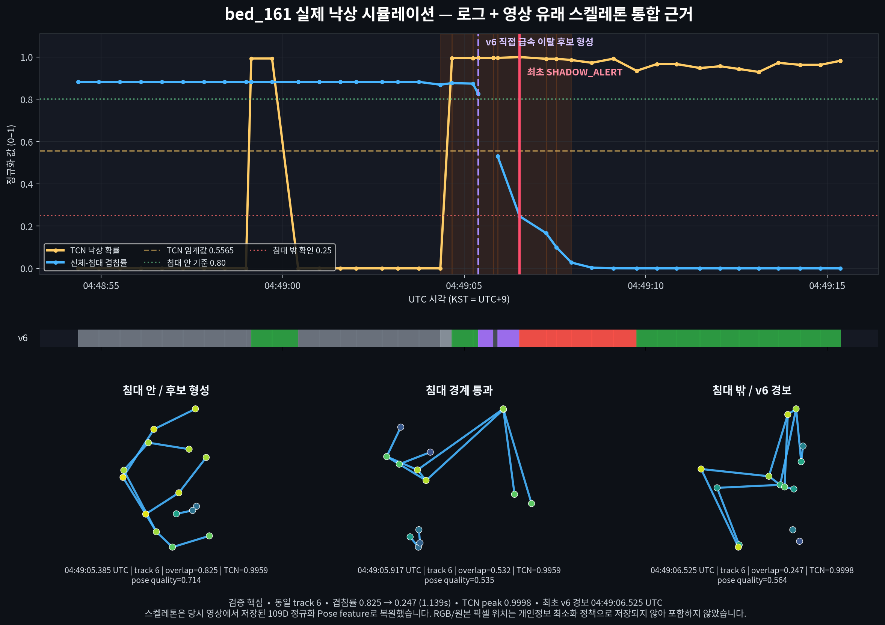

# 낙상 이벤트 로그·Pose 통합 근거 — bed_161

## 결론

2026-08-14에 사용자가 수행했다고 확인한 **통제된 안전 낙상 시뮬레이션** 한 건을 재검증했다. 당시 운영 중이던 v5 기록은 사건을 `VERIFY`까지만 분류했지만, 같은 입력을 현재 `hybrid_v6_direct_rapid_bed_departure` 규칙에 재생하면 **최초 후보 형성 후 1.139초에 `SHADOW_ALERT`가 발생한다.**

이는 “현재 v6이 이 사례를 shadow 경보로 검출한다”는 근거다. 실제 환자 낙상 검증이나 production 알람 승격을 의미하지는 않는다.



SVG 원본은 [fall_event_evidence_dashboard.svg](artifacts/fall_event_bed_161_20260814_0449/fall_event_evidence_dashboard.svg), 기계 판독 수치는 [evidence.json](artifacts/fall_event_bed_161_20260814_0449/evidence.json)에 있다.

## 핵심 수치

| 항목 | 결과 |
|---|---:|
| 카메라 / track | `bed_161` / `6` |
| v6 후보 형성 | 2026-08-14 04:49:05.385646 UTC (13:49:05.385646 KST) |
| 최초 v6 shadow 경보 | 2026-08-14 04:49:06.525045 UTC (13:49:06.525045 KST) |
| 후보→경보 | 1.139399초 |
| 신체-침대 겹침률 | 0.824884 → 0.246541 |
| 구간 내 TCN 최고 확률 | 0.999758 |
| TCN 임계값 | 0.5565 |
| v6 경보 risk | 0.617403 |
| 저장 Pose | 159 samples × 109 features |
| 고정 로그 | 41 rows |

## 시간 순서

| UTC 시각 | 침대 겹침률 | TCN | 당시 v5 | 현재 v6 해석 |
|---|---:|---:|---|---|
| 04:49:05.385646 | 0.824884 | 0.995933 | `CANDIDATE` | 침대 안 + rapid motion + TCN persistent로 직접 급속 이탈 후보 형성 |
| 04:49:05.802015 | 관측 누락 | 0.995933 | `INSUFFICIENT` | 짧은 Pose dropout 구간 |
| 04:49:05.917859 | 0.531654 | 0.995933 | `CANDIDATE` | 동일 track이 침대 경계를 통과 |
| 04:49:06.525045 | 0.246541 | 0.999758 | `VERIFY` | 2초 이내 `outside <= 0.25` 확인, 최초 `SHADOW_ALERT` |
| 04:49:07.256013 | 0.166437 | 0.991773 | `VERIFY` | 침대 밖 상태 지속 |

최초 v6 경보의 직접 근거는 다음 다섯 항목이다.

```text
rapid_motion
tcn_persistent
outside_bed
direct_rapid_bed_departure
direct_rapid_bed_departure_confirmed
```

## “영상 기반”의 정확한 의미

이 세션에는 RGB나 원본 동영상이 저장되지 않았다. 개인정보 최소화 설계에 따라 영상에서 계산한 다음 값만 남았다.

- 동일 인물의 정규화된 COCO-17 관절 좌표·confidence·visibility
- 자세 확률과 사람 관측 상태
- 관절 속도
- 합계 109차원 feature, 159개 관측
- 침대 segmentation과 사람 영역에서 계산한 `body_in_bed_ratio`
- motion burst, TCN 확률, fusion 상태 로그

그림 아래의 세 스켈레톤은 이 저장된 109D 좌표로 복원한 **실제 영상 유래 Pose**다. 좌표가 인물 중심으로 정규화되어 있으므로 침대에 대한 절대 픽셀 위치는 나타내지 않는다. 그 공간 변화는 위 그래프의 침대 겹침률로 제시한다.

## 원본과 재현성

| 자료 | SHA-256 |
|---|---|
| 세션 manifest | `b6b63d1871c2c8892adab173c72813fe5736d4bd2128e0ad10bb9ffe60eff020` |
| 159×109 feature NPZ | `c25e88c991dc5029144ccc210c0d6b5b3e2043833e2a996d8a330cb7ca332029` |
| 사건 구간 고정 JSONL | `d6df5889b5ac83dd20aa68f838e286406dee3546c155a57f2551a12579d578e3` |

고정 사건 로그는 [event_log_rows.jsonl](artifacts/fall_event_bed_161_20260814_0449/event_log_rows.jsonl)이다. 계속 추가되는 일일 운영 로그 대신 이 파일을 증거 스냅샷으로 사용한다.

다시 생성하는 명령은 다음과 같다.

```bash
cd /home/dmc/AI/DMC_POSE
/home/dmc/anaconda3/envs/pose-cuda/bin/python scripts/build_fall_event_evidence.py
```

## 판정 경계

| 질문 | 판정 |
|---|---|
| 이 통제 낙상 사례에서 TCN이 강한 신호를 냈는가? | 예 |
| 침대 안→밖의 공간 전이가 로그에 존재하는가? | 예 |
| 현재 v6이 같은 입력을 shadow 경보로 검출하는가? | 예 |
| 당시 v5 라이브가 실제 경보를 냈는가? | 아니오, `VERIFY`까지였음 |
| 실제 환자 낙상을 입증하는가? | 아니오 |
| production 경보로 즉시 승격 가능한가? | 아니오 |

다음 승격 근거에는 빠른 정상 침대 이탈 하드 네거티브 반복, 여러 사람·여러 카메라·느린 미끄러짐 사례, 장시간 false-alert/bed-hour 평가가 추가되어야 한다.

