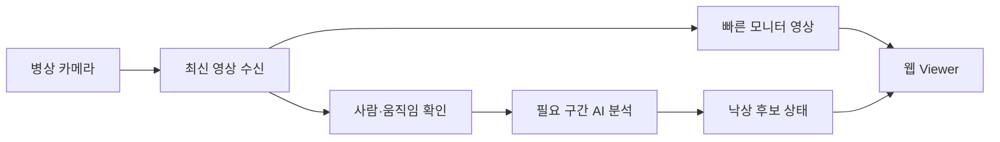

# DMC POSE 로컬 운영 안내

병상별 카메라를 한 화면에서 모니터링하고 낙상 후보 상태를 확인하는 로컬 실행 안내서입니다.

> 현재 낙상 결과는 검증용 shadow 단계입니다. 의료 판단이나 실제 비상 호출을 대신하지 않습니다.

## 시스템 흐름



영상 표시는 AI 분석과 분리되어 있습니다. AI가 모든 프레임을 처리하지 않아도 Viewer는 최신 영상을 계속 표시합니다. 사람이 없을 때는 분석 빈도를 낮추고, 사람이나 큰 움직임이 관측되면 분석을 집중합니다.

## 실행

```bash
cd /home/dmc/AI/DMC_POSE
./run_all_cameras.sh
```

브라우저:

```text
http://<서버-IP>:8000/viewer
```

상태 확인:

```text
http://<서버-IP>:8000/status
```

정상 시작 시 다음 내용이 표시됩니다.

```text
Multi-Camera Pipeline 시작
TCN shadow loaded
Uvicorn running on 0.0.0.0:8000
```

## 화면 상태 이해하기

| 표시 | 의미 |
|---|---|
| 연결됨 | 카메라 최신 프레임이 들어오는 상태 |
| 사람 감지 | 분석 대상이 관측된 상태 |
| `TCN ready=false` | 동일 사람의 시간 관측이 아직 부족한 상태 |
| 관찰/검증 중 | 움직임을 더 집중해서 확인하는 상태 |
| `SHADOW_ALERT` | 검증용 낙상 후보이며 실제 알람은 아님 |

사람이 화면에 들어온 직후에는 시간 정보가 쌓이지 않아 ready가 바로 켜지지 않을 수 있습니다.

## 활용 가능 범위

- 여러 병상 카메라의 동시 영상 모니터링
- 사람 없음 상태에서 불필요한 분석 부하 절감
- 침대 영역 자동 인식과 사람 움직임 관찰
- 낙상 후보의 shadow 검증
- 녹화 영상 replay를 통한 변경 전후 비교
- 앉기·눕기·줍기 등 오탐 행동 수집
- Pi 장비 연결 및 단계적 현장 배포 준비

아직 실제 비상 알람 자동 발송이나 의료기기 수준의 판정에는 사용할 수 없습니다.

## 문제가 생겼을 때

1. `/status`가 열리는지 확인합니다.
2. Viewer의 카메라 연결 표시를 확인합니다.
3. 영상만 멈췄는지 카메라 입력 자체가 끊겼는지 구분합니다.
4. 사람이 있는데 감지되지 않으면 잠시 움직인 뒤 상태 갱신을 확인합니다.
5. 같은 서버를 중복 실행하지 않았는지 확인합니다.

간헐적인 H.264 decode 경고는 네트워크 패킷 또는 키프레임 문제일 수 있습니다. 경고가 반복되면서 화면까지 멈출 때 카메라 연결을 점검하세요.

## 저장소 주의

카메라 계정, 실제 영상, 학습 데이터, 모델 가중치, SSH 키 및 운영 로그를 소스 저장소에 추가하지 마세요. 로컬 운영자는 이 문서의 실행·Viewer·상태 확인 범위만 사용합니다.
