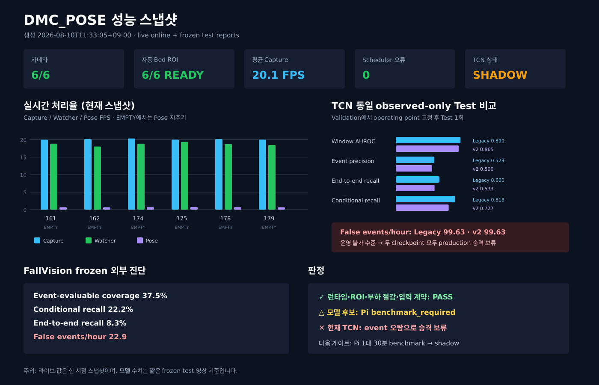

# DMC_POSE 성능 요약 — 2026-08-07

생성 시각: `2026-08-10T11:33:05+09:00`  
Live 상태: **live status online**  
판정: **런타임 PASS / 모델 production 승격 보류 / Pi benchmark 필요**

## 실시간 6카메라 스냅샷

| Camera | Mode | Capture FPS | Watcher FPS | Pose FPS | ROI IoU | Inference ms |
|---|---|---:|---:|---:|---:|---:|
| bed_161 | EMPTY | 19.97 | 18.84 | 0.68 | 0.980 | 4.94 |
| bed_162 | EMPTY | 20.17 | 18.03 | 0.66 | 0.908 | 5.42 |
| bed_174 | EMPTY | 20.33 | 18.84 | 0.70 | 0.980 | 5.27 |
| bed_175 | EMPTY | 19.99 | 19.34 | 0.72 | 0.990 | 5.16 |
| bed_178 | EMPTY | 20.16 | 18.76 | 0.70 | 0.854 | 5.26 |
| bed_179 | EMPTY | 20.00 | 18.46 | 0.67 | 0.983 | 5.78 |

## TCN frozen test

| Checkpoint | Window AUROC | Event precision | End-to-end recall | Conditional recall | False events/hour |
|---|---:|---:|---:|---:|---:|
| Legacy | 0.8905 | 0.5294 | 0.6000 | 0.8182 | 99.63 |
| v2 observed-only | 0.8645 | 0.5000 | 0.5333 | 0.7273 | 99.63 |

FallVision frozen 진단은 coverage `0.3750`, conditional recall `0.2222`, end-to-end recall `0.0833`입니다. 짧은 평가 시간 때문에 FP/hour 신뢰구간이 넓으며, 현재 수치는 운영 승격 근거가 아닙니다.

출처: `runs/temporal_tcn/observed_only_checkpoint_comparison_recheck_20260807.json`, `runs/temporal_tcn/fallvision_pilot_balanced_diagnostic_v1_report_recheck_20260807.json`, `:8000/status`.
