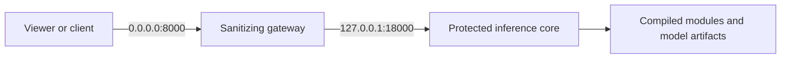

# Private Core / Public Gateway Deployment

## Purpose

The protected inference application must not expose internal model scores,
policy states, feature values, or framework-generated API documentation to the
LAN.  The deployed topology therefore has two HTTP boundaries:



## Network contract

| Listener | Bind | Role |
|---|---|---|
| Public gateway | `0.0.0.0:8000` | Viewer, image/video proxy, minimal status |
| Private core | `127.0.0.1:18000` | Full internal application; never LAN-bound |

The public status schema is intentionally fixed:

```json
{
  "bed_161": {
    "camera_id": "bed_161",
    "state": "EMPTY",
    "updated_at": "2026-08-14T00:00:00Z"
  }
}
```

Allowed states are `EMPTY`, `MONITORING`, and `ALERT`.  `/docs`, `/redoc`, and
`/openapi.json` are disabled.  The gateway never forwards arbitrary paths or
upstream error bodies.

## Runtime checks

```bash
ss -ltnp | grep -E ':8000|:18000'
curl -fsS http://127.0.0.1:8000/health/ready
curl -fsS http://127.0.0.1:8000/status
curl -fsS http://127.0.0.1:18000/health/ready
```

Expected binding:

```text
0.0.0.0:8000
127.0.0.1:18000
```

## Security boundary

This topology prevents network clients from reading the private Core API.  It
does not protect against an administrator with root access to the host.  Root
can read process memory, model files, compiled binaries, and service settings;
that threat requires a separate trusted host or hardware-backed confidential
execution boundary.
