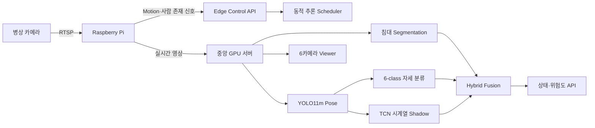

# DMC POSE 프로젝트 기여·이력서 기록 — 2026-08-10

## 객관적 프로젝트 정의

> Raspberry Pi 기반 엣지 카메라와 중앙 GPU 서버를 연동한 다중 병상 실시간 자세·낙상 위험 모니터링 AIoT 시스템 개발

이 프로젝트는 단일 AI 모델 실험이 아니라 카메라 입력, 엣지 장치, 중앙 추론, 시계열 분석, 위험 판단, 웹 모니터링과 장애 복구를 연결한 AIoT 소프트웨어 솔루션이다.

실제 회사 내 역할이 개인 전담이었고 회사가 이를 확인할 수 있다면 다음 표현을 사용할 수 있다.

> 다중 병상 낙상 위험 모니터링 AIoT 솔루션 설계·개발·현장 연동 1인 전담

근로장학생은 행정적 신분이며, 실제 수행 역할은 `AI/Edge/Backend Engineer` 또는 `AIoT 소프트웨어 개발 전담`으로 함께 표기한다.

## 구현 아키텍처



## 실제 구현 범위

### 다중 카메라와 실시간 백엔드

- 6대 병상 RTSP 카메라 동시 수신 및 카메라별 병렬 분석
- 영상 표시와 AI 분석 경로를 분리한 latest-frame 구조
- FastAPI 기반 실시간 Viewer, 상태 API와 Edge Control API
- H.264 손상 프레임, RTSP 끊김 및 재연결 상태 관측
- 중앙 latest-only 우선순위 추론 scheduler 구현

### 침대와 사람 분석

- 침대 Segmentation 기반 카메라별 ROI 자동 검출
- confidence, 다중 후보와 IoU 합의 기반 ROI 검증
- ROI 캐시 및 저주기 갱신으로 반복 추론 부하 감소
- MobileSAM 기반 ROI refinement 경로
- YOLO11m Pose 기반 사람 및 17개 keypoint 추출
- 다중 사람 추적, primary person 선택과 track 변경 처리
- 침대 ROI와 신체 구조의 겹침을 이용한 침대 안·가장자리·밖 판정
- 6-class 자세 분류 모델 연동

### 시계열과 위험 판단

- 실제 관측 Pose만 사용하는 10 Hz `30×109` TCN 입력 계약
- missing row 삽입 및 이전 skeleton 복사 제거
- track 변경과 시간 gap 발생 시 시계열 상태 초기화
- GMDCSA-24와 FallVision 데이터 감사·전처리·라벨 통합 작업
- window 지표와 event recall, context coverage, false events/hour 평가 분리
- 침대 위치, 자세, 운동학, tracking, Pose 품질과 TCN을 결합하는 Hybrid Fusion
- 정상 눕기, 빠른 눕기, 줍기, 쪼그리기, 바닥 앉기 등 hard-negative 실물 검증

### Raspberry Pi 엣지 canary

- `bed_161` CM4에서 저비용 Motion watcher와 YOLO11n 사람 존재 감지
- 인증된 Edge 결과로 중앙 고비용 분석을 깨우는 wake bridge
- SQLite durable outbox로 네트워크 장애 시 결과 유실 방지
- SSH 공개키, bearer token과 systemd 서비스 운영
- Edge 장애 3초 후 중앙 watcher와 기존 Pose 주기로 자동 복구
- Edge 복구 시 중앙 절전 모드 자동 복귀

Pi의 YOLO11n 결과는 위험 근거가 아니라 wake/person-presence 힌트로만 사용한다. 최종 Pose, 침대 ROI, TCN과 Fusion 판단은 중앙 서버가 담당한다.

## 증명 가능한 정량 성과

| 항목 | 검증 결과 |
|---|---:|
| 동시 카메라 | RTSP 6대 |
| 중앙 Viewer용 캡처 | 약 20 FPS |
| 빈 병상 중앙 Pose cadence | 0.75 Hz → 0.05 Hz |
| 빈 병상 Pose 부하 절감 | 실측 94.07% |
| CM4 YOLO11n warm Pose | 약 184 ms |
| CM4 motion trigger-to-result | 약 186 ms |
| Edge 장애 failover grace | 3초 |
| 최신 edge-managed 회귀검사 | 23개 통과 |
| Phase 10 데이터 계약 단위검사 | 당시 보고 기준 84개 통과 |

추가 실물 cycle에서는 240개 중앙·Edge sample을 오류 없이 수집하고 `EMPTY → OCCUPIED/BURST → EMPTY` 전이를 확인했다. 정상 침대 가장자리 착석에서 TCN shadow가 최대 `0.9993`의 오탐 확률과 56개 candidate sample을 생성했지만, 구조적 Fusion은 `SAFE/WARMING` 범위에서 이를 모두 억제하고 실제 frame fall score를 `0`으로 유지했다. 이는 TCN 단독 승격 보류와 하이브리드 판단 설계의 필요성을 실환경에서 확인한 결과다.

실제 입실, 침대 착석, 중앙 확인, 퇴실 후 `EMPTY` 복귀를 검증했다. Edge 장애 및 복구 과정에서도 RTSP 카메라 파이프라인 재시작 없이 중앙 감시 전환과 절전 복귀가 작동했다.

근거 문서와 원시 아티팩트:

- `docs/CM4_BED_161_CANARY_STATUS_2026-08-10.md`
- `runs/edge_benchmarks/cm4_bed_161/central_edge_managed_bed_161_2026-08-10.json`
- `runs/edge_benchmarks/cm4_bed_161/cm4_live_pose_shadow_2026-08-10.json`
- `runs/edge_benchmarks/cm4_bed_161/bed_161_physical_cycle_post_outbox_fix_2026-08-10.json`
- `runs/edge_benchmarks/cm4_bed_161/bed_161_physical_cycle_feature_audit_2026-08-10.json`
- `docs/PERFORMANCE_SUMMARY_2026-08-07.md`

## 이력서 권장 표기

### 소속과 역할

```text
OO회사 | AIoT 소프트웨어 개발 전담
근로장학생 — AI/Edge/Backend Engineer
```

### 프로젝트 제목

```text
Raspberry Pi–중앙 GPU 서버 기반 다중 병상 낙상 위험 모니터링 AIoT 솔루션 1인 전담 개발
```

### 경력·프로젝트 기술 문장

- 6대 병상 RTSP 카메라를 동시 처리하는 실시간 AI 모니터링 시스템을 설계하고 FastAPI Viewer·상태 API·추론 scheduler를 구현
- 침대 Segmentation, YOLO11m Pose, 6-class 자세 분류 및 TCN 시계열 분석을 결합한 하이브리드 위험 판단 파이프라인 개발
- Raspberry Pi의 Motion·경량 Pose wake와 중앙 GPU 고정밀 추론을 결합한 Edge–Server 분산 구조 설계
- 빈 병상 중앙 Pose 추론을 `0.75 Hz`에서 `0.05 Hz`로 낮춰 부하를 실측 `94.07%` 절감하면서 Viewer 약 `20 FPS` 유지
- Pi 통신 장애 시 3초 후 중앙 감시로 자동 전환되고 복구 후 절전 모드로 복귀하는 failover 정책 구현
- GMDCSA-24·FallVision 및 자체 데이터를 위한 10 Hz observed-only skeleton 시계열 전처리와 event-level 평가 체계 구축

## 기술 스택

```text
Python, PyTorch, TensorFlow/Keras
Ultralytics YOLO11, TCN, ONNX Runtime, TFLite
OpenCV, FFmpeg, RTSP, MediaMTX
FastAPI, Uvicorn, REST API
Raspberry Pi CM4, Linux, systemd
SQLite, JSONL, SSH, Bearer Token
Git, pytest
```

## 과장 방지를 위한 현재 경계

- 중앙 6카메라 파이프라인은 구현됐지만 Edge-managed 실물 canary 통과는 현재 `bed_161` 한 대다.
- TCN은 입력 계약과 평가 파이프라인을 구축했으나 성능상 운영 경보로 승격하지 않은 shadow 모델이다.
- 따라서 `상용 낙상 경보 제품 전체 배포 완료`라고 표현하지 않는다.
- 현재 완료 수준의 정확한 표현은 다음과 같다.

> 다중 병상 AIoT 모니터링 중앙 파이프라인을 구축하고, Raspberry Pi 한 대에 Edge-managed canary를 배포해 실환경 입·퇴실 및 장애 복구까지 검증했다.
