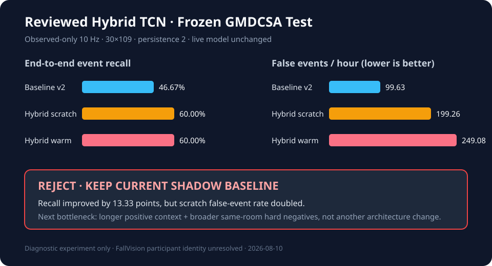

# Reviewed Hybrid TCN 진단 실험 — 2026-08-10

## 결론



데이터 통합 파이프라인은 성공했지만 새 TCN은 **승격하지 않는다**. 라이브 서버는 기존
`runs/temporal_tcn/gmdcsa24_tcn/model.pt`와 threshold `0.55654`를 계속 사용하며 TCN은
shadow-only다.

새 scratch 모델은 동결 GMDCSA test의 end-to-end event recall을 높였지만 false event가
두 배가량 증가했다. 병실 알림 시스템에서는 이 trade-off를 허용할 수 없다.

## 사용 데이터와 누수 경계

```text
GMDCSA observed-only train 313창
  + FallVision 수동 완료 양성 12창
  + 자체 검토 정상 hard-negative 124창
  = hybrid train 449창

GMDCSA validation 106창: 원본과 값·메타데이터 완전 동일
GMDCSA test       176창: 원본과 값·메타데이터 완전 동일

FallVision archive holdout diagnostic:
  양성 4창 + 비낙상 48창 = 52창
```

FallVision 학습/holdout archive group 교집합은 0이다. 그러나 참가자 ID가 복원되지 않아
archive-disjoint가 subject-disjoint임을 보장하지 못한다. 따라서 FallVision 결과는 진단용이며
승격 지표가 아니다.

양성에는 `manual_interval_diagnostic_only`와 `manual_pilot`인 항목만 사용했다. 자동 proposal,
weak label, 영상 전체 fall 확대 라벨은 사용하지 않았다. 자체 데이터는 운영자가 명시적으로
검토한 `binary_fall_label=0` 세션만 사용했다.

## GMDCSA 동결 test 결과

운영과 동일한 persistence 2, merge gap 3초 기준이다.

| 모델 | Event precision | End-to-end recall | Conditional recall | False events | False events/hour |
|---|---:|---:|---:|---:|---:|
| observed-only v2 baseline | 0.4667 | 0.4667 | 0.6364 | 8 | 99.63 |
| hybrid scratch | 0.3600 | 0.6000 | 0.8182 | 16 | 199.26 |
| hybrid warm-start | 0.3103 | 0.6000 | 0.8182 | 20 | 249.08 |

Scratch가 warm-start보다 낫지만 baseline보다 false events/hour가 약 2배다. 두 모델 모두
운영 불가다.

## Validation-only 사건 operating point 재보정

창 단위 recall 정책이 임계값을 지나치게 낮춘 가능성을 분리하기 위해 threshold `0.05~0.95`와
persistence `1~3`을 validation에서만 탐색하고, 선택값을 동결 test에 한 번 적용했다.

| 모델 | 선택 threshold / persistence | Test precision | Test recall | False events/hour |
|---|---:|---:|---:|---:|
| 기존 legacy checkpoint | 0.27 / 2 | 0.5294 | 0.6000 | 99.63 |
| hybrid scratch | 0.37 / 1 | 0.4762 | 0.6667 | 136.99 |
| hybrid warm | 0.73 / 1 | 0.5385 | 0.4667 | 74.72 |

Scratch는 recall을 높이는 대신 오탐을 늘리고, warm은 오탐을 줄이는 대신 recall을 낮춘다.
기존 모델보다 precision·recall·오탐을 동시에 개선한 모델이 없으므로 승격 판단은 변하지 않는다.
두 hybrid 후보 모두 persistence 1을 선택했다는 점도 단일 probability spike에 민감한 운영 위험이다.

## FallVision archive holdout 진단

### Persistence 2

양성 4개 영상은 usable 30-row window가 각각 하나뿐이다. 따라서 연속 두 창을 요구하는
운영 persistence 2에서는 사건을 구조적으로 확정할 수 없다. 두 모델 모두 recall 0이었다.

### Persistence 1 — 분류 가능성만 분리 측정

| 모델 | Event precision | Recall | False events | False events/hour |
|---|---:|---:|---:|---:|
| hybrid scratch | 0.2353 | 1.0000 | 13 | 615.08 |
| hybrid warm-start | 0.2500 | 1.0000 | 12 | 567.77 |

양성 창을 구분하는 신호는 있으나 비낙상 오탐이 매우 많다. 평가 노출시간도 약 0.021시간으로
짧아 시간당 비율의 신뢰구간이 넓다. persistence 1은 진단일 뿐 운영 설정 변경 근거가 아니다.

## 생성 아티팩트

- 데이터 패키지 보고서:
  `external_datasets/windows/tcn_109_v2_no_missing/reviewed_hybrid_v1/report.json`
- Train-only 증강:
  `external_datasets/windows/tcn_109_v2_no_missing/reviewed_hybrid_v1/augmentation_train_only/`
- FallVision 진단 holdout:
  `external_datasets/windows/tcn_109_v2_no_missing/reviewed_hybrid_v1/fallvision_archive_holdout_diagnostic/`
- 병합 학습셋:
  `external_datasets/windows/tcn_109_v2_no_missing/gmdcsa24_reviewed_hybrid_v1_3s/`
- Scratch 결과:
  `runs/temporal_tcn/gmdcsa24_reviewed_hybrid_v1_scratch/`
- Warm-start 결과:
  `runs/temporal_tcn/gmdcsa24_reviewed_hybrid_v1_warm/`

## 다음 데이터 목표

모델 구조를 다시 바꾸기보다 다음 데이터가 먼저 필요하다.

1. 각 양성 사건에 운영 persistence 2 이상을 적용할 수 있도록 낙상 전후 유효 Pose 창을 확보한다.
2. 같은 병실 시점에서 쪼그리기, 바닥 앉기, 빠르게 눕기, 물건 줍기 등 비낙상 다양성을 늘린다.
3. 자체 양성은 onset 전 8~10초, 사건 후 5초 이상을 포함해 기록한다.
4. 참가자/세션/카메라 단위 group split을 확정한 뒤에만 승격 평가를 다시 수행한다.

## Round 2 수동 승인 진단 — 2026-08-14

운영 persistence 2를 만족할 가능성이 있는 FallVision 후보 20개를 골라 간단 승인 UI로
검토했다. 11개는 `complete`, 9개는 영상 오류 또는 판단 불가로 `excluded` 되었고 미처리
항목은 0개다. 제외 항목은 manifest와 추출 입력에서 차단했다.

승인 11개를 라이브와 동일한 YOLO11m Pose, observed-only 10 Hz, 109D 계약으로 재추출했다.

```text
영상 추출 성공       11 / 11
30×109 창 생성 영상   7 / 11
생성 창              20 (fall 18, pre-event non-fall 2)
event evaluable        7 / 11
persistence=2 evaluable 6 / 11
pre-onset ready         0 / 11
```

고정 operating point에서 기존 legacy와 v2 모델은 persistence 평가 가능한 6건을 모두
검출했다. 전체 사건 기준 recall은 `6/11=54.55%`, event-evaluable 조건부 recall은
`6/7=85.71%`였다. 이 세트는 전부 낙상 영상이고 평가 시간이 약 47초뿐이므로 false event
0건을 특이도 개선으로 해석하면 안 된다. 이 11개는 양성 진단 holdout으로 보존하며 학습에는
추가하지 않는다.

관련 결과:

- `external_datasets/manifests/fallvision_round2_persistence11_manual_v1.json`
- `external_datasets/windows/tcn_109_v2_no_missing/fallvision_round2_persistence11_manual_v1_3s/`
- `runs/temporal_tcn/fallvision_round2_persistence11_fixed_diagnostic.json`

## 재현 명령

```bash
python3 scripts/build_reviewed_hybrid_augmentation.py

python3 scripts/merge_temporal_window_sets.py \
  --base external_datasets/windows/tcn_109_v2_no_missing/gmdcsa24_3s \
  --augment external_datasets/windows/tcn_109_v2_no_missing/reviewed_hybrid_v1/augmentation_train_only \
  --out external_datasets/windows/tcn_109_v2_no_missing/gmdcsa24_reviewed_hybrid_v1_3s

python3 train_tcn.py \
  --windows-dir external_datasets/windows/tcn_109_v2_no_missing/gmdcsa24_reviewed_hybrid_v1_3s \
  --out-dir runs/temporal_tcn/gmdcsa24_reviewed_hybrid_v1_scratch \
  --device cpu
```

검증 당시 전체 테스트는 `212 passed`였다. 사건 평가에는 지정 persistence를 만족할 수 있는
유효 창 수를 따로 나타내는 `persistence_evaluable_coverage`도 추가했다.
