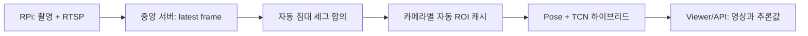

# Phase 2 — 침대 영역 완전 자동화

## 결론

침대마다 카메라가 한 대씩 설치되는 환경에서는 사람이 ROI를 그리는 절차를 운영 요건에서 제거한다.
카메라가 추가되면 서버가 해당 카메라 ID의 침대 영역을 자동으로 학습하고 캐시한다.



상세 흐름은 `04_auto_bed_roi_flow.mmd`에 있다.

## 카메라 한 대가 처음 연결될 때

1. 서버는 침대 세그멘테이션을 매 3번째 분석 프레임에 실행한다.
2. 최근 5개 후보 중 최소 3개를 모은다.
3. 후보 bbox의 median IoU가 기본 0.75 이상일 때만 합의 완료로 인정한다.
4. mask는 픽셀 다수결, bbox와 confidence는 중앙값으로 확정한다.
5. 카메라 ID별 JSON, mask PNG, 장면 기준 이미지를 `bed_roi/auto_cache/`에 저장한다.
6. 합의 전에는 `ROI_NOT_READY`이며 임시 검출을 낙상 판정에 사용하지 않는다.

## 합의 완료 후 부하 절감

- 매 프레임 침대 세그를 실행하지 않는다.
- 캐시된 침대 영역은 Pose/TCN 판정에 즉시 사용한다.
- 기본 300초마다 세그를 한 번 실행하여 캐시를 검증한다.
- 저해상도 흑백 장면 비교는 계속 수행하지만 YOLO보다 훨씬 저렴하다.
- 뷰어는 latest-frame capture를 직접 사용하므로 ROI 학습과 추론 속도에 종속되지 않는다.

## 카메라가 움직이거나 화각이 바뀔 때

- 전체 장면 변화율이 기준을 3회 연속 넘으면 캐시를 자동 무효화한다.
- 해상도가 바뀌어도 즉시 무효화한다.
- 갱신 세그가 기존 bbox와 합의하지 않아도 무효화한다.
- 이후 다시 자동 후보 수집부터 시작한다.
- 수동 좌표로 fallback하지 않는다.

## API에서 확인할 필드

| 필드 | 의미 |
|---|---|
| `bed_roi_ready` | 합의된 자동 ROI가 실제 판정에 사용 가능한지 |
| `bed_roi_source` | `auto_consensus`, `auto_cache`, `auto_refresh`, `auto_not_ready` |
| `bed_roi_agreement_iou` | 후보 또는 갱신 결과의 공간 일치도 |
| `bed_roi_candidate_count` | 현재 수집된 자동 후보 수 |
| `bed_seg_run_count` | 이 프로세스에서 실행한 침대 세그 횟수 |
| `bed_roi_invalid_reason` | 준비되지 않았거나 폐기된 이유 |

## 재시작 후 승인 검사

```bash
cd /home/dmc/AI/DMC_POSE

python scripts/check_auto_bed_roi.py \
  --url http://127.0.0.1:8000/status \
  --timeout 90 \
  --settle-seconds 8
```

통과 기준은 6대 모두 `READY`, 합의 직후 8초 동안 `bed_seg_run_count`가 증가하지 않는 것이다.
캡처 FPS는 별도 기준으로 약 20 FPS를 유지해야 한다.

## 조정 가능한 환경 변수

```text
POSE_SEG_EVERY=3
POSE_AUTO_BED_WINDOW=5
POSE_AUTO_BED_MIN_DETECTIONS=3
POSE_AUTO_BED_CONSENSUS_IOU=0.75
POSE_AUTO_BED_REFRESH_SEC=300
POSE_AUTO_BED_SCENE_CHANGE_RATIO=0.75
POSE_AUTO_BED_SCENE_CHANGE_PERSISTENCE=3
```

운영 중에는 우선 기본값을 유지하고, 실제 카메라에서 합의 실패 원인이 확인된 경우에만 조정한다.
