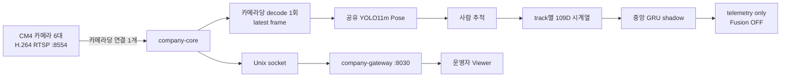

# DMC POSE 운영 안내

이 폴더는 현장 서비스를 다루는 **유일한 운영 진입점**입니다. 개발·학습 코드는
`/home/dmc/AI/DMC_POSE_source`에 있으며, 여기서는 서비스 시작/중지, shadow 상태
확인, 검증된 배포 도구만 제공합니다.

> 현재 낙상 모델의 권한은 `telemetry_only`입니다. Fusion과 실제 경보는 꺼져
> 있으며, 모델 출력만으로 의료 판단이나 비상 호출을 수행하지 않습니다.

## 1분 빠른 시작

```bash
cd /home/dmc/AI/DMC_POSE
./run.sh status
./run.sh viewer
```

서비스가 꺼져 있을 때만 시작합니다.

```bash
./run.sh start
```

기본 Viewer는 `http://192.168.0.108:8030/viewer`입니다.

## 현재 운영 흐름



현재 `deploy-shadow` 계약은 `20Hz / 80 rows / 4초` GRU입니다. 실제 live Pose
처리율과 사람 추적이 계약을 만족하는지는 별도 검증 중이며, `ready=false` 또는
`predictions=0`이면 모델이 정상적으로 판단했다고 해석하면 안 됩니다.

## 명령

| 목적 | 명령 | 변경 여부 |
|---|---|---|
| 명령 목록 | `./run.sh help` | 없음 |
| Viewer 주소 | `./run.sh viewer` | 없음 |
| 기본 health | `./run.sh health` | 없음 |
| 서비스·카메라 TCP 점검 | `./run.sh doctor` | 없음 |
| 서비스 상태 | `./run.sh status` | 없음 |
| 중앙 shadow 상세 상태 | `./run.sh shadow-status` | 없음, sudo 필요 |
| 20Hz 배포 사전계획 | `./run.sh shadow-plan` | 없음 |
| 10Hz 배포 사전계획 | `./run.sh shadow-plan-10hz` | 없음 |
| 서비스 시작/재시작/중지 | `./run.sh start\|restart\|stop` | 있음, sudo 필요 |
| 20Hz telemetry shadow 배포 | `./run.sh deploy-shadow` | 있음, sudo 필요 |
| 10Hz telemetry shadow 배포 | `./run.sh deploy-shadow-10hz` | 있음, sudo 필요 |

배포 전에는 반드시 대응하는 `shadow-plan`을 먼저 확인합니다. 20Hz와 10Hz는
동시에 배포하는 모델이 아니라 **서로 다른 대체 계약**입니다.

## 상태를 읽는 기준

사람이 없는 카메라에서 다음은 정상입니다.

```text
person_count=0
tcn_samples=0
tcn_ready=false
tcn_predictions=0
```

사람이 실제로 들어온 뒤에는 같은 track이 유지되면서 samples가 창 크기까지
증가하고, `ready=true`, `predictions>0`가 되어야 temporal 성능을 평가할 수
있습니다. 현재 경보 승격 전 최소 확인 항목은 다음과 같습니다.

- RTSP 연결 6개와 서비스 restart 0
- scheduler error/timeout 0
- Pose 처리율이 배포 계약에 충분한지
- 바닥 전환 중 사람·Pose·track이 소실되지 않는지
- sample window 준비와 prediction 증가
- Fusion은 검증 종료 전까지 비활성

## 현장 파인튜닝

파인튜닝은 live 서비스를 자동 변경하지 않는 별도 오프라인 작업입니다.

```bash
./site-finetune.sh check <manifest.json> [run-name]
./site-finetune.sh train <manifest.json> <run-name> [epochs]
```

자세한 계약은
[`SITE_FINETUNE_QUICKSTART.md`](../docs/SITE_FINETUNE_QUICKSTART.md)를
참조합니다.

## 개발자 문서

- [현재 아키텍처](../docs/CURRENT_ARCHITECTURE.md)
- [개발자 인수인계](../docs/DEVELOPER_GUIDE.md)
- [문서 인덱스](../docs/README.md)
- [2026-08-28 파일 감사](../docs/FILE_AUDIT_2026-08-28.md)

## 운영 원칙

- `/opt/.company-core`를 직접 편집하지 않습니다.
- `runs`, 가중치, 데이터셋, `build`를 임의로 지우지 않습니다.
- `deploy-shadow*`는 plan, 백업, hash 검증을 거치는 제공 명령으로만 실행합니다.
- 문제 발생 시 카메라 ID, 발생 시각, `shadow-status` 결과를 함께 기록합니다.
